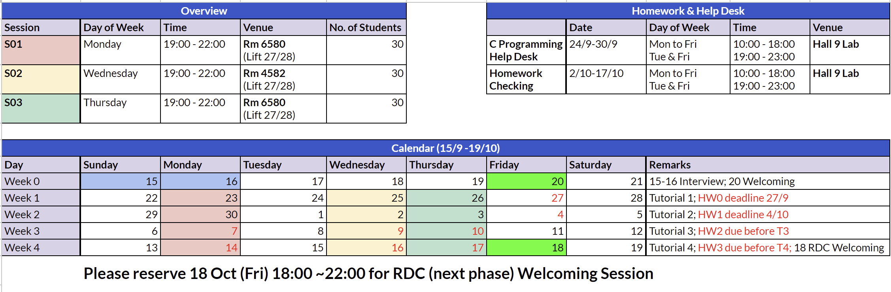

# Overview

> funny words on computer make robot go brrrr weeee

Welcome to the HKUST Robotics Team Software Tutorial!

Here is a brief overview of our schedule:

~~speed run 90% COMP 1021, 80% COMP 2011, 20% ELEC 1100, 70% ELEC 3300, 30% COMP 2211, 5% COMP 4421, ...~~

<figure><figcaption>
2024 schedule
</figcaption></figure>

## New Update!!!

Advanced Tutorial details for Trainees who could join the next phase:
(if you submitted most of the stuff and attended all tutorials, you are likely to join the next phase)

Advanced Tutorial 1: Image Processing
- 19 Oct 2024 (Sat) 14:00 - 17:00 Room 2302(Lift 17/18) (Remarks: 1 hour after COMP 2012 midterm)
- 21 Oct 2024 (Mon) 19:00 - 22:00 Room 2303(Lift 17/18)

Advanced Tutorial 2: CAN and RM Motor Control
- 23 Oct 2024 (Wed) 19:00 - 22:00 Room 2405(Lift 17/18)
- 24 Oct 2024 (Thur) 19:00 - 22:00 Room 5619(Lift 31/32)
---

[Homework arrangement](homework-demo-arrangements.md)

* [Tutorial 0: self-learning basic C](tutorial-0-self-learn-basic-c/README.md)
* [Tutorial 1: C and STM32 Development Environment Setup](tutorial-1-c-and-cubeide-setup/README.md)
* [Tutorial 2: Basic IO (GPIO and TFT)](./tutorial-2-basic-io/README.md)
* [Tutorial 3: Advanced IO (PWM and servo control)](tutorial-3-advanced-io/README.md)
* [Tutorial 4: UART](tutorial-4-uart/README.md)

[Lists of Links](SUMMARY.md)

Advanced tutorials will be held later in the next phase. There are also advanced notes for your own reading. Feel free to reach out to any team members if you have any questions about anything related to the tutorials or the team in general.

Please also make sure to join our [Discord](https://discord.gg/PNnQdjzt58) server for more important announcements.
