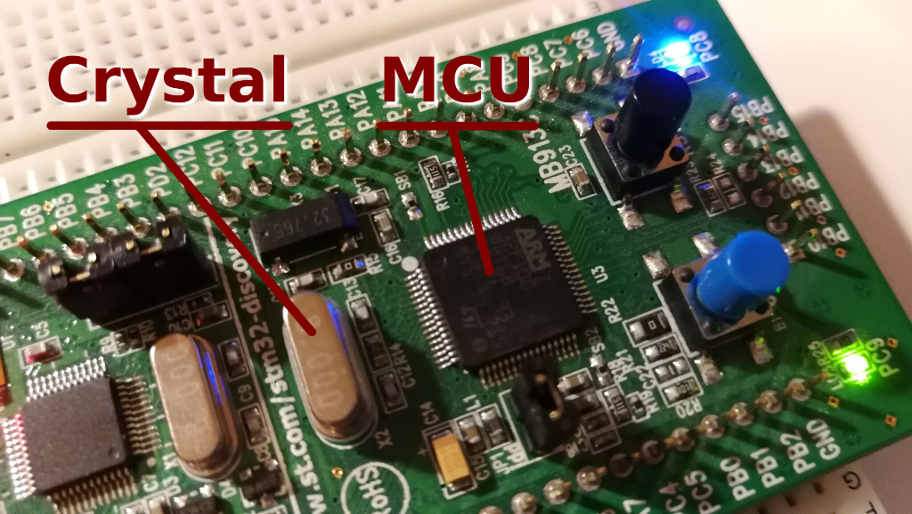
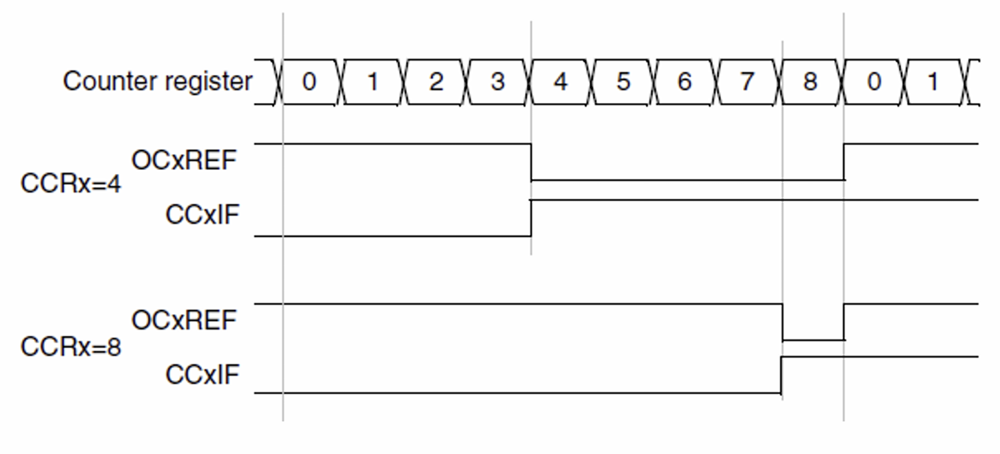

# Introduction to Embedded System - STM32

> Introduction to fundamental concepts and knowledge of STM, Interrupt, GPIO,
> and Timer.

> Basically more advanced theories that we skipped in the tutorials but covered in ELEC 3300

<details>

<summary>Authors</summary>

Dicaprio Cheung
Henry Loi

</details>

## Table of Content

- [Before Start](introduction-to-embedded-system-stm32.md#before-start "mention")
- [Interrupt and Polling](introduction-to-embedded-system-stm32.md#interrupt-and-polling "mention")
- [GPIO](introduction-to-embedded-system-stm32.md#gpio "mention")
- [PWM and Timer](introduction-to-embedded-system-stm32.md#pwm-and-timer "mention")
- [Communication Protocol](introduction-to-embedded-system-stm32.md#communication-protocol "mention")

## Before Start

### What is Embedded system?

An embedded system is a system in which the computer (generally a microcontroller or microprocessor) is included as an integral part of the system. For example, your phone, ATM, door ball, etc.

### What is STM32?

STM stands for STMicroelectronics, a multinational corporation and technology company. It is famous by its microcontroller integrated circuits. In daily life, STM mainly stands for STM microcontroller unit series.

### What is Microcontroller (MCU)?

An MCU is an intelligent semiconductor IC that consists of a processor unit, memory modules, communication interfaces, and peripherals. In short, a lower-level CPU.&#x20;

We mainly use STM32 Series MCU for our embedded system development.&#x20;

Here is the list of STM32 Series MCU:

<figure><figcaption><p>Figure 1: STM32 Series Table</p></figcaption></figure>

The MPU naming logic of STM is similar to CPU.

&#x20;                             **Intel                                                                                STM**

.png)

**VS** 

.png)

&#x20;

## Interrupt and Polling

> HAL_UART_Transmit_IT() is actually Interrupt and HAL_UART_Transmit() is actually Polling

### What is polling?

Let’s try to understand the concept first. You have many things to do in your everyday life Consider your daily life as a while loop like this:

```c
while(everyday){
    wakeup;
    breakfast;
    lunch;
    tea;
    dinner;
    supper;
    sleep;
}
```

> Everyone of you has a mobile phone, will you do a polling on your mobile phone ? :mobile\_phone:
>
> How do you know if someone calls you ?  :calling:
>
> What happen if your mobile phone is set to mute ? :no\_bell:

Here is a polling code example:

```c
int main(){
    HAL_Init();
    SystemClock_Config();
    MX_GPIO_Init();
    while (1){
        if (HAL_GPIO_ReadPin(GPIOB, GPIO_PINC) == 0){
            // follow sequence to toggle the RGB LED
        }
    }
}
```

### What is Interrupt?

You can consider interrupt is a procedure call. If you enabled the interrupt, the machine will go to do that procedure. That procedure is called **Interrupt Service Routine (ISR)**.&#x20;

Note that once you enabled the interrupt, you **DON’T** need to do polling. If you use both polling and interrupt for the same event, you have a major conceptual error&#x20;

> Do you need to continuously keep checking your phone to see if someone calls you if you set your phone to ring mode ? :thinking:

In STM32, there is a NVIC (Nested Vectored Interrupt Controller) to control up to 81 interrupts and with 16 level of priority.

### How to enable interrupt?

In CubeIDE, before you generate the code, you need to enable the GPIO to be interrupt. Let say we use PA0 as an example:

1\. Select GPIO\_EXI0 in .ioc

<figure><figcaption></figcaption></figure>

2. GPIO mode -> External Interrupt Mode with Rising edge trigger detection

<figure><figcaption></figcaption></figure>

3. In NVIC, Enable the EXTI line0 interrupt.

<figure><figcaption></figcaption></figure>

4. In Code generation, EXTI line0 interrupt, check the box Call HAL handler. You can then generate your code.

<figure><figcaption></figcaption></figure>

5. Originally, the implementation of ISR are contained in the file `stm32f10x_it.c`.  Open the file and locate the following:

```c
/**
* @brief This function handles EXTI line0 interrupt.
*/
void EXTI0_IRQHandler(void){
    /* USER CODE BEGIN EXTI0_IRQn 0 */
    /* USER CODE END EXTI0_IRQn 0 */
    HAL_GPIO_EXTI_IRQHandler(GPIO_PIN_0); // <- HAL ISR
    /* USER CODE BEGIN EXTI0_IRQn 1 */
    /* USER CODE END EXTI0_IRQn 1 */
}
```

6. We can modify the code and replace the replac the orginal IRQHandler:

```c
void EXTI0_IRQHandler(void) {
    /* USER CODE BEGIN EXTI0_IRQn 0 */
    if (__HAL_GPIO_EXTI_GET_IT(GPIO_PIN_0) != RESET){
        __HAL_GPIO_EXTI_CLEAR_IT(GPIO_PIN_0);
        HAL_GPIO_EXTI_Callback(GPIO_PIN_0);
    }
    /* USER CODE END EXTI0_IRQn 0 */
    // HAL_GPIO_EXTI_IRQHandler(GPIO_PIN_0); // this line is commented
    /* USER CODE BEGIN EXTI0_IRQn 1 */
    /* USER CODE END EXTI0_IRQn 1 */
}
```

## GPIO

We have already taught what is GPIO before, however, we would like to go one step further to explain the difference between different GPIO ouput mode and why it is programmable.&#x20;

Let's review the previous gpio notes: [gpio](../tutorial-2-basic-io/gpio/ "mention")

## PWM and Timer

Same as GPIO, we have taught PWM timer before, but we didn't explain the concept in detail.

> What do **CCR** actually means?
>
> Is combination of **prescalar (PSC)** and **auto-reload (ARR)** really a up-to-you combination?
>
> When do we need +1 when calculating  **prescalar (PSC)** and **auto-reload (ARR)**?&#x20;


### How PWM works?

REF: ELEC1100 lecture 10 (2022, Deparment of Electronic and Computer Engineering, HKUST)  

### Concept of PWM

GPIO is like a switch. It can only do On/Off, Max Power/No Power, Move/Stop. However, sometimes we would like to have 50%/30% power. So, we are doing some trick.

### **Pulse Width Modulation(PWM)**

Let's say we want to output a 30% power. However, our board is weak and can only output HIGH(100%) and LOW(0%) voltages only. So, instead of trying to output a 30% Voltage, we will keep turning it ON and OFF very quickly. If we turn On (output HIGH) for 30% of the time and turn Off (output LOW) for the remaining 70% of the time.

Then, the average output would be:

100% Voltage \*30% time + 0% Voltage \*70% time = 30% power.

If the board changes between HIGH and LOW very quickly (i.e. 50 times per second or above), you and the motor cannot see the difference between a 30% output voltage and 30% PWM signal.

### MCU_Clock

MCU_Clock is the heart of the MCU. On your mainboard, your Hardware teammates have soldered a MCU and a Crystal.



The Crystal is a quartz resonator that generates a stable resonant frequency. The crystal on your mainboard generates a 84 MHz frequency clock signal. That's why the MCU_Clock frequency is 84 MHz.

The MCU Clock controls how fast your MCU runs. The MCU will execute 1 instruction/command whenever it receives a rising edge of the clock signal. So, your MCU can execute 84 million instructions per second. 

### Prescalar Value, Auto Reload Register


Both Prescalar Value and Auto Reload Register are some special registers inside the MCU. 

Registers are very small, very fast memory units that are very close to the MCU/CPU. They are even closer to the CPU than your RAM inside your laptop. 

#### Prescalar Value (PSC)

Let's make the wordings clear:

- Prescalar Counter Register is a 16 bit register inside the MCU.
- `Prescalar Register` is the number you input in TIMx->PSC

Initially, the Prescalar Counter Register is 0

Whenever there is a rising edge in the clock signal, the Prescalar Counter Register increase by 1. 

If the Prescalar Counter Register == `Prescalar Register`,
- Prescalar Counter Register reset to 0
- Outputs a prescalar clock signal

Since we counts from 0 to `Prescalar Register`, We actually counted (`Prescalar Register` + 1) times. So, we output a prescalar clock signal once every (`Prescalar Register` + 1) rising edges of the MCU clock signal. So, it slows down the MCU_Clock frequency by (`Prescalar Register` + 1) times.

#### Auto Reload Register (ARR)

Auto Reload Register is exactly the same as Prescalar Value except it counts prescalar clock signal instead of MCU Clock signal

Let's make the wordings clear:

- Counter Register is a 16 bit register inside the MCU.
- `Auto Reload Register` is the number you input in TIMx->ARR

Initially, the Counter Register is 0

Whenever there is a rising edge in the **prescalar clock signal**, the Counter Register increase by 1. 

If the Counter Register == `Auto Reload Register`,
- Counter Register reset to 0
- Outputs a Timer clock signal

Since we counts from 0 to `Auto Reload Register`, We actually counted (`Auto Reload Register` + 1) times. So, we output a Timer clock signal once every (`Auto Reload Register` + 1) rising edges of the prescalar clock signal. So, it slows down the prescalar clock frequency by (`Auto Reload Register` + 1) times.

So, in total, the MCU clock is slowed down (`Prescalar Register` + 1) * (`Auto Reload Register` + 1) times. That's how the formula in the PWM tutorial comes from:

$$
Timer \space freqency = \frac{MCU\_Clock\space frequency}{(Prescaler\space Value+1) \cdot (Auto\space reloaded\space counter+1)}
$$

##### Example

`Prescalar Register` = 1
`Auto Reload Register` = 36 
"MCU_Clock" is the MCU Clock signal 
"Clock after prescalar" is the **prescalar clock signal**
"Counter overflow" is the Timer signal

REF: ELEC 3300 Tutorial for LAB 4


#### Compare Register (CCR)

Compare Register is slightly different from Prescalar Value and Auto Reload Register

Let's make the wordings clear:
- Compare Register is the number you input in CCR

The Compare Register checks the Counter Register.
If Counter Register is smaller than (<) Compare Register, outputs HIGH or ON
else outputs LOW or Off

##### Example

"Counter Register" is the Counter Register Register
`Auto Reload Register` = 8 
The upper `CCR value` = 4
The lower `CCR value` = 8
"OCxREF" is the PWM output signal

ignore the "CCxIF"

REF: ELEC 3300 Tutorial for LAB 4



### Other usage of PWM

Apart from controlling the angle of a servo motor, we can use PWM to control the speed of a DC(Direct Current) Motor. (DC motors can spin like a wheel)

For servo motor, On-time controls the angle/position of the servo.

For DC motor, On-time controls the velocity/power of the DC motor.

## Communication Protocol

There are many communication protocol for different types of sensors and motors.

For example,

- PWM
- UART
- USART
- CAN
- DMA
- I2C
- SPI
- USB

and many more

So, you can google yourself for the STM32 F405 datasheet or ask your Hardware mentors.