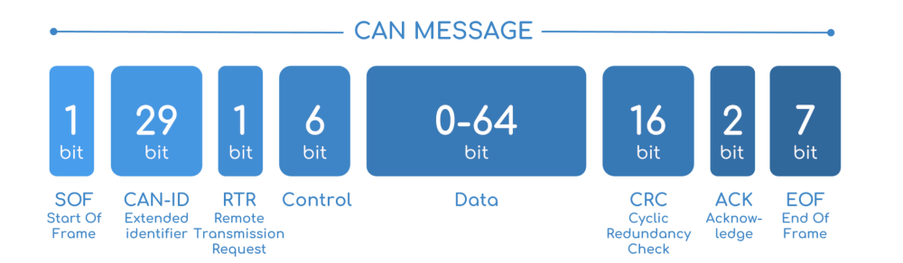

# CAN theory

Reference

Version created by:
Dennis, Amber

Modified by:
Chalex, Brian

## Quick Teleporter

1. [Introduction](CAN-bus.md#introduction)
2. [What is CAN?](CAN-bus.md#what-is-can)
3. [How does CAN work?](CAN-bus.md#how-does-can-work)  
    3.1. [decoding signal](CAN-bus.md#decoding-signal-differential-signal)  
    3.2. [data-format](CAN-bus.md#data-format)  

### Introduction
Before this tutorial, you've learnt two types of <ins>conversation protocol</ins>:

1. **PWM** (Pulse Width Modulation)

    Rely on `duty cycle`, sending signal to control a motor.
    
    * Pros: Provide simple connection (single wire) and analog-like output.
    * Cons: Limited responses, no feedback can be received.
2. **UART** (Universal Asynchronous Receiver/Transmitter)

    Rely on `TX-RX` relations, reading value under common baud rate.

    * Pros: Simple code, cheap and easy-development.
    * Cons: Only 1-to-1 connection, inaccurate and limited protection.

## What is CAN?
* CAN, or Controller area network, is an **electronic communication** bus defined by the `ISO 11898` standards. Those standards define how communication happens, how wiring is configured and how messages are constructed, among other things. Collectively, this system is referred to as a CAN bus.
* **All nodes** can “hear” all transmissions. There is no way to send a message to just a specific node. The CAN hardware, however, provides local filtering so that each node **may react only on the interesting messages**.
* CAN Generally provides a more secure network than PWM and UART, therefore we're using them to control our motor.

In Summary, CAN has the following advantages:
1. Allows multiple "devices" connected in `bus` status.
2. Allows data to be transferred in **protected and accurately**.

However, CAN is usually more advanced and complicated, it requires the help from Hardware component. Thus, not all module actually support CAN!

## How does CAN work?

### Decoding Signal (Differential Signal)

When decoding the signal, we compare the differences and generates the result **hardwarely**.  
> This is a **hardware** solution, so you cannot swap two wires!!!  
(they blindly perform `High - Low` to measure differences)

When the resultant voltage Difference is **Large**, they're considered as Dominant (0)  
When the resultant voltage Difference is **Small**, they're considered as Recessive (1)

The way data is sent on the CAN Bus is through **differential signalling**. We uses both the line `CAN High` and `CAN Low` to transmit the data at the same time. Compared to something like UART, CAN is more **reliable and less susceptible** to interference/noise.

### Data format
Base frame format (11-bit identifier)  
&#x20;

Extended frame format (29-bit identifier)  
&#x20;

A CAN data frame can be divided into 8 parts:

1. Start of Frame (SOF)
2. Arbitration (consists of 2 parts)\
   \- CAN-ID: 11-bit or 29-bit identifier\
   \- a remote transmission (RTR) bit.
3. Control
4. Data
5. Cyclical redundancy check (CRC)
6. Acknowledge (ACK)
7. End of Frame (EOF).

Generally, the whole data-set should be wrap in `SOF` and `EOF`, to indicate a "data package"

These data package consist an unique `CAN-ID`, which represents the sender/receiver (depends on usage).

In case this message is just a 'request', it can be set empty in `RTR` field. However, we're not covering this in this tutorial.

To indicates size of the data package, we put our length in `control` field (0~8 bytes).

`Data` field can have variable size, depends on `control` field. Data such as motor-current, motor-speed etc will be included here.

`CRC` and `ACK` is basically some fact-check bits, we're not covering them in this tutorial.

> There are some advanced protocol used to prevent data collision, but we're not covering them here, as they're too advanced and not necessary to know. Feel free to search online and self-study if you want.
