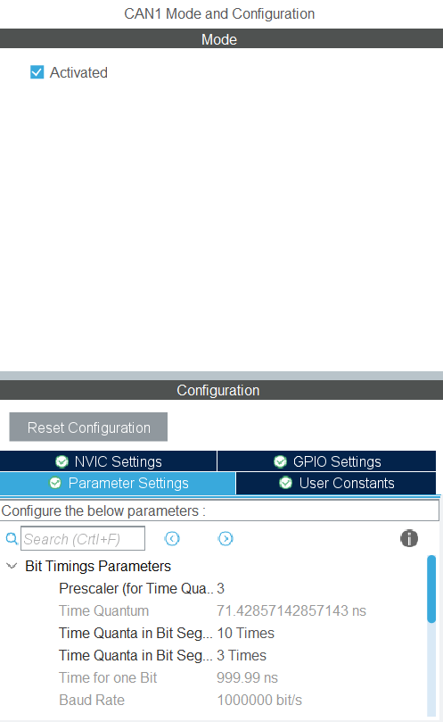
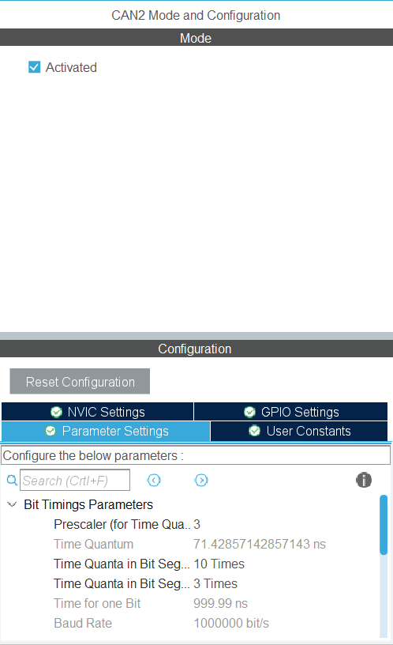
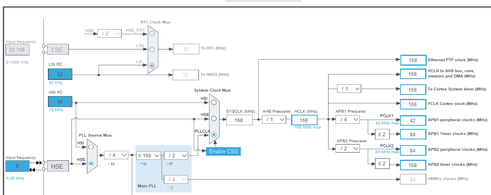

# Configuring CAN in STM32

## Quick Teleporter

1. [Related Features](RM-motor-control.md#can-related-functions)
2. [Initialization](RM-motor-control.md#initialization)
3. [Data-collection](RM-motor-control.md#data-collection)
4. [Example code](RM-motor-control.md#example-code)

This should already be done for you in our boilerplate code.

| **CAN1** | **CAN2** |
-----------|-----------
 | 

**Clock Config** 

<figure><figcaption></figcaption></figure>

Just make sure the clock config are the same.

## CAN-related Functions
Before trying to use CAN, please find and replace the `can.h` and `can.c` in the `Inc` and `Src` folders respectively. We have defined some helper functions for you to make your life easier.

Download_Link: [can.c](source/can.c) [can.h](source/can.h)

Similar to all other protocol, CAN requires two steps, **CAN Init** & **CAN Data Collection**

## Initialization

As mentioned, there are 2 CAN buses available to you on the mainboard. The `hcan1` and `hcan2` objects are defined by the STM32HAL library.

```c
CAN_HandleTypeDef hcan1; // CAN 1
CAN_HandleTypeDef hcan2; // CAN 2
----------------------------
void can_init(); // Initialize both CAN 1 & 2
```

We have created a `can_init()` function to help you initialize the buses. Please make sure you call this function **once** before your `while` loop (like all your other initialization functions).

## Data Collection
After initialization, please also make sure to call the function below repeatedly inside your `while` loop to ensure you are able to continuously **send data to the motors** and **receive feedback**:

```c
void can_ctrl_loop(); // Data Collection
```

To identify the devices on your CAN bus (Motor controller), we've defined the following enum `Motor` to provide a readable ID as your references:

```c
typedef enum {
    // CAN 1
	CAN1_MOTOR0, CAN1_MOTOR1,
	CAN1_MOTOR2, CAN1_MOTOR3,
	CAN1_MOTOR4, CAN1_MOTOR5,
	CAN1_MOTOR6, CAN1_MOTOR7,
    // CAN 2
	CAN2_MOTOR0, CAN2_MOTOR1,
	CAN2_MOTOR2, CAN2_MOTOR3,
	CAN2_MOTOR4, CAN2_MOTOR5,
	CAN2_MOTOR6, CAN2_MOTOR7,
    // For Calculation
	MAX_NUM_OF_MOTORS
} Motor;
```

> The maximum number of `C620 Robomaster motors` that can be used on a single CAN bus is 8, hence the limit.  
The motor number corresponds to the `CAN ID` of the motor, which is configured on the motor itself. More on configuring that later.

Thus, you can **control** and **receive** message from the following function:

```c
/**
 * define a struct to access the feedback value.
 * 
 * encoder: motor's position (unit: ???) [0 ~ 8191]
 * vel_rpm: motor's velocity (unit: rpm)
 * actual_current: motor's current (unit: ???) [-16384 ~ 16384] / [-10000 ~ 10000]
 * temperature: current motor's temperature (only for C620)
 */
typedef struct {
	uint16_t encoder;
	int16_t vel_rpm;
	float actual_current;
	uint8_t temperature;
} MotorStats;

/**
 * tar_motor: input motor
 * 
 * Positive tar_current: Spin clockwise.
 * Negative tar_current: Spin anti-clockwise.
 * Max current is capped at 10000 (unit: ???).
 */
void set_motor_current(Motor tar_motor, int16_t tar_current);

/**
 * tar_motor: input motor
 * 
 * returns motor feedback stats for a specific motor
 */
MotorStats get_motor_feedback(Motor tar_motor);
```

## Example code

The code below shows you how to retrieve and send CAN message at the same time. This will rotate your motor in clockwise.

```c
// main.c - main()

// all your other init functions
can_init(); // initialize CAN
while (1) {
    /* USER CODE END WHILE */
    /* USER CODE BEGIN 3 */

    // control the motor with the buttons
    if (btn_read(BTN1)) {
        set_motor_current(CAN1_MOTOR0, 700);
    } else if (btn_read(BTN2)) {
        set_motor_current(CAN1_MOTOR0, -700);
    } else {
        set_motor_current(CAN1_MOTOR0, 0);
    }

    // printing feedback on TFT
    tft_prints(0, 0, "VEL: %5d", get_motor_feedback(CAN1_MOTOR0).vel_rpm);
    tft_prints(0, 1, "ENC: %5d", get_motor_feedback(CAN1_MOTOR0).encoder);
    tft_prints(0, 2, "CUR: %5d", get_motor_feedback(CAN1_MOTOR0).actual_current);
    
    // update tft & CAN status
    tft_update(100); // update the TFT value every 100 ms
    can_ctrl_loop(); // update the CAN command & feedback
}

```

> The example above assumes you are using CAN1, and that your motor has a CAN ID of 0.

For more information, you may check the official data-sheet to obtain the most accurate information  
[RM-motor data-sheet](https://rm-static.djicdn.com/tem/17348/RoboMaster%20C620%E6%97%A0%E5%88%B7%E7%94%B5%E6%9C%BA%E8%B0%83%E9%80%9F%E5%99%A8%E4%BD%BF%E7%94%A8%E8%AF%B4%E6%98%8E%EF%BC%88%E4%B8%AD%E8%8B%B1%E6%97%A5%EF%BC%89V1.01.pdf)  
[RM-motor C610 data-sheet](https://rm-static.djicdn.com/tem/17348/RoboMaster%20C610%20Brushless%20DC%20Motor%20Speed%20Controller%20User%20Guide.pdf)
