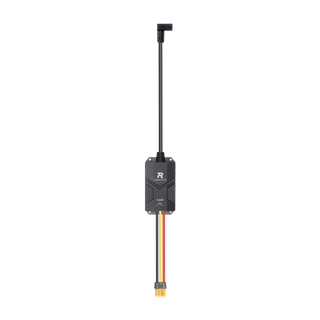
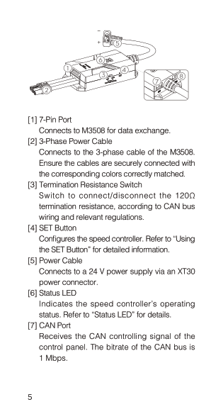
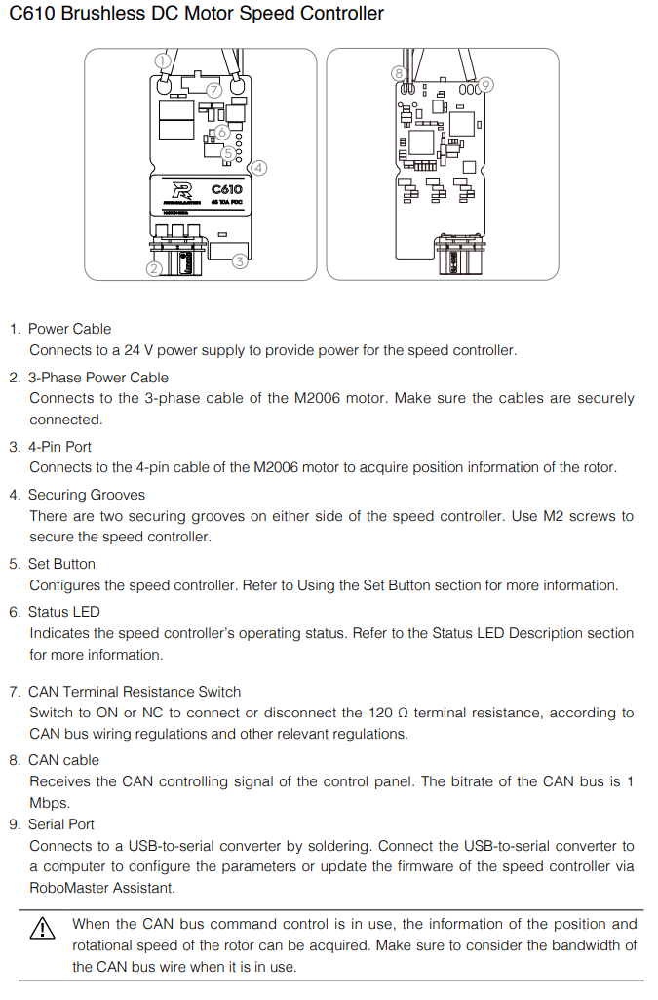
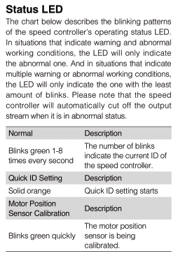
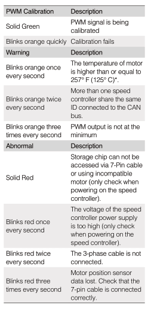
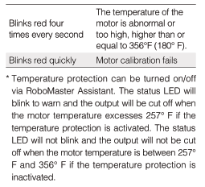
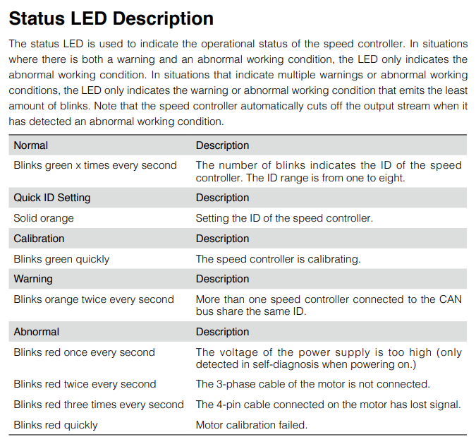
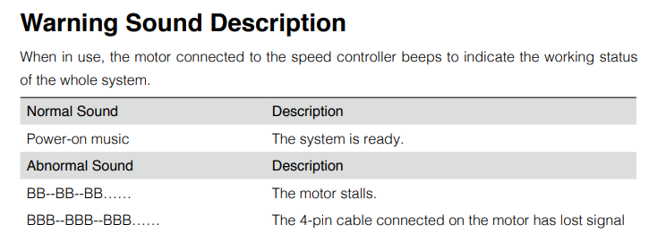
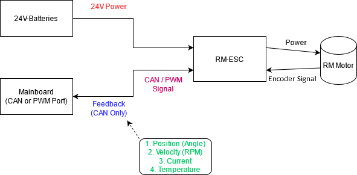

# Robomaster Motor

## Quick Teleporter

1. [Wiring and power supply](RM-motor.md#wiring-and-power-supply)
2. [Potential Damage](RM-motor.md#potential-damage)
3. [Prevention](RM-motor.md#prevention)
4. [Configure RM-ID](RM-motor.md#configuration-of-rm-id)
5. [Calibrate RM-motor](RM-motor.md#calibration-of-the-rm-motor)  
   5.1. [Background](RM-motor.md#background)  
   5.2. [Procedures](RM-motor.md#procedures)  
   5.3. [Led-signals](RM-motor.md#led-signal)
6. [Electrical Structure](RM-motor.md#electrical-structure-of-a-rm-control-system)
7. [Common errors](RM-motor.md#common-errors)
8. [Comparison](RM-motor.md#comparison)
9. [Using PWM](RM-motor.md#driving-rm-through-pwm)

The Robomaster Motor (commonly called to RM in our team), pictured below, is the motor you will be using in the RDC:  

Aside from the motor itself, we also need an **external device** to convert the CAN signals we send into commands the motor actually understands, called an `RM-ESC` (Electronic Speed Controller), pictured below:

## Wiring and power supply

C620 | C610
---|---
 | 

**RM3508 (C620)**
* Both `[1]` and `[2]` will attached to the RM motor.
* Connect `[5]` to a 24V cell battery (ask hardware for help if unsure!)
* `[7]` is CAN port and `[8]` is PWM port

**RM2006 (C610)**  
Similar to RM3508, just with different interface

**NOTE**
> you should only choose one port for motor drive (CAN/PWM), we suggest you to use **CAN**, while **PWM** is also a feasible method.

## Potential Damage

1. Collision
   * Dropping
   * your robot crashes and damage the exposed RM motor
2. Overheating
   * Cause
     1. Over-driving (Forcing the motor to provide excessive amount of torque)
     2. Short circuit
        * 24V power wire is shorted and so the motor is provided with too much current
        * Heating effect (Hopefully you have learnt high school physics)
   * Results
     1. Non Permanent Damage
        * Just some warmth
     2. Permanent Damage
        * Electrical component gets damaged
        * More serious cases: **Sparks** and **Smoke**

**NOTE**
> Please check the temperature of both `ESC` and `RM` motor if something weird happened. e.g. burning smell, motor didn't move when it previously worked properly

## Prevention

1. Make sure that the ESC is **tightly tied** to the robot internally.
2. Ensure there is nothing that blocks the rotation motion of the RM motor (e.g. Loose screws)
   * **Turn off** the 24V power supply, and try to rotate and ensure nothing on the way.
   * Remove the obstacle if you can or else **find a mech member** to deal with it
3. Overheating
   * Irritating Smell (Smells like burning rice lol)
   * Cool down in whatever way you can (Preferably use compressed air in the lab to cool it down)
   * Find your mech member to save your motor lol.

**Always turn off 24V power supply first when accidents happen, if you don't want to lose your hand**

## Configuration of RM-ID

Steps:

1. Find a hard rod with a small end (We use tweezers most of the time)
2. Poke the SET Button `[4]` in the upper image to set the CAN ID.
   * The first press will enter you in configure mode.
   * Press the button for target_RM-ID + 1 times
3. Watch the LED blink and make sure the CAN ID is correct
   * ID = LED blink time - 1

## Calibration of the RM motor

### Background

As every `RM-motors` has different status (e.g. current and inductance differentiate over time), calibration is required for `RM-ESC` to obtain the status, so that it can drive in best-condition.

### Procedures

1. Again, find thin, long, hard thing. (e.g. tweezers)
2. Hold the **SET** Button for a **long time** and it will enter the calibration mode.  
Remember to Hold your motor on your hand tightly.
3. Wait until the LED blinks green **quickly**.
4. The motor will start spinning slowly, just wait until it stops.

> Please ensure that there is no obstacle bothering the RM motor spinning motion, and grab your motor during the process.

### LED Signal

TLDR: Any LED signal except for a green blinking LED is not a good sign.  

**C620 RM3508 driver(BIG RM)**
 |  | 
---|---|---|

**C610 RM2006 driver(SMALL RM)**
 | 
---|---|

### Electrical Structure of a RM control system

#### Common Errors

> Arranged in order of occurrence

_**24V power**_

| Symptom                | Meaning                             | Solution                                                                                                             |
| ---------------------- | ----------------------------------- | -------------------------------------------------------------------------------------------------------------------- |
| No LED Light at all    | No input power source               | 
1. Check if the wire is plugged in or not 2. Check if the fuse is burnt 3. Ask hardware people for help
 |
| Solid red LED          | No CAN signal from the RM Motor     | Check the 7-pin wire connected to the RM Motor                                                                       |
| Red LED blinking twice | The 3-phase cable is not connected. | Check the connection between RM-Motor and ESC (3-phase cable)                                                        |

_**Signal**_

> Do these when you are sure it's not the power's problem _CAN:_

| Possible Problem | Diagnosis                                                                                                                                                                                                                                                                                                                     | Solution                                       |
| ---------------- | ----------------------------------------------------------------------------------------------------------------------------------------------------------------------------------------------------------------------------------------------------------------------------------------------------------------------------- | ---------------------------------------------- |
| Wrong CAN ID     | Check Check Check                                                                                                                                                                                                                                                                                                             | Reinitialize the correct CAN ID                |
| Wrong CAN Bus    | See if any motors are not moving the way you want                                                                                                                                                                                                                                                                             | Send message to the right bus instead          |
| Wrong CAN Port   | Again, Check Check Check                                                                                                                                                                                                                                                                                                      | I mean, just don't plug it into the wrong hole |
| Broken CAN wire  | 
1. Find a hardware member 2. Check with a <a href="https://cdn.sparkfun.com/assets/learn_tutorials/1/01_Multimeter_Tutorial-09.jpg?__hstc=250566617.4b44870ec4a577029c49e44b73bd3bee.1627603200060.1627603200061.1627603200062.1&#x26;__hssc=250566617.1.1627603200063&#x26;__hsfp=3390389424">DMM in beep mode</a>
 | Just get a new wire                            |

_PWM:_

| Possible Problem                                     | Diagnosis                                                                                                                                                                                                                                                                                                                     | Solution                            |
| ---------------------------------------------------- | ----------------------------------------------------------------------------------------------------------------------------------------------------------------------------------------------------------------------------------------------------------------------------------------------------------------------------- | ----------------------------------- |
| Incorrect frequency/ on time initialized in the code | 
1. Check with Oscilloscope 2. Check your code
                                                                                                                                                                                                                                                                       | Change it back lol                  |
| False soldering for the pwm pins on the mainboard    | Find a hardware member for help                                                                                                                                                                                                                                                                                               | Hardware member should deal with it |
| Broken PWM Wire                                      | 
1. Find a hardware member 2. Check with a <a href="https://cdn.sparkfun.com/assets/learn_tutorials/1/01_Multimeter_Tutorial-09.jpg?__hstc=250566617.4b44870ec4a577029c49e44b73bd3bee.1627603200060.1627603200061.1627603200062.1&#x26;__hssc=250566617.1.1627603200063&#x26;__hsfp=3390389424">DMM in beep mode</a>
 | Just get a new wire                 |
| Broken ESC (Basically never happened)                | 
When you are a <strong>100%</strong> sure you did everything correctly and the motor is not working properly Swap with an ESC that works and see if it's actually faulty
                                                                                                                                            | Just get a new ESC                  |

## Comparison
**CAN vs PWM**

Both PWM and CAN can be used to control the motor.

**PWM:**

Advantage:

* Easier to use and implement

Disadvantage:

* PWM can only output signal and can't get the feedback data back. As in real-life condition, the motor cannot be exactly identical (As said from above). If we just output a signal without getting feedback, the speed of motor may not be the same. Therefore, the wheelbase may not move as you want it to be.

**CAN:**

Advantage:

* **FEEDBACK FROM MOTOR!!**\
  Feedback is important because while we can command the motor to do something (e.g. move at a certain speed), there's no guarantee the motor actually does that perfectly. Manufacturing errors exist, and fluctuations happen. A motor you command to move at 100rpm may actually be moving at 90rpm or 120rpm. For maximum accuracy and precision, we want to monitor the actual state of the motor, and use the feedback to implement something we call **closed loop control.** (See: [pid.md](../advanced-notes/pid.md "mention"))

Disadvantage:

* A bit annoying to implement(requires more work)
* Hard to debug when there are problems
  * Could be because of:
    * CAN IC
    * CAN wire
    * Hardware soldering
    * CAN port
    * Code
    * or EVERYTHING

## Driving RM through PWM

In this tutorial, we won't be covering this part. Please refer to the data sheet yourself if you wish to use this. **again, we strongly not suggest you to use PWM here!**

We need to keep the RM pwm at the resting on-time which is around 1465\~1500(us), it may be different among different set of ESC and board (Please try the value between the range and find one suitable on your machine)

The frequency for controling rm is from 50Hz \~ 500Hz (personally i use 50Hz to do the testing)

If the LED light appears at blink 3 times that means the pwm signal you input isn't low enough, you can try other value, untill it blink at green light(and blink same number as it can id), and then it will stay at rest. Then you can turn the pwm value to other value to perform the work.

The on-time to the speed graph is shown at below.

For more information, you may check the official data-sheet to obtain the most accurate information  
[RM-motor C620 data-sheet](https://rm-static.djicdn.com/tem/17348/RoboMaster%20C620%E6%97%A0%E5%88%B7%E7%94%B5%E6%9C%BA%E8%B0%83%E9%80%9F%E5%99%A8%E4%BD%BF%E7%94%A8%E8%AF%B4%E6%98%8E%EF%BC%88%E4%B8%AD%E8%8B%B1%E6%97%A5%EF%BC%89V1.01.pdf)  
[RM-motor C610 data-sheet](https://rm-static.djicdn.com/tem/17348/RoboMaster%20C610%20Brushless%20DC%20Motor%20Speed%20Controller%20User%20Guide.pdf)