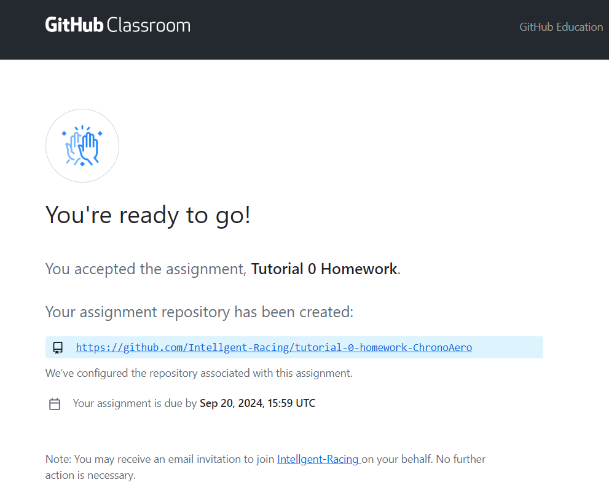
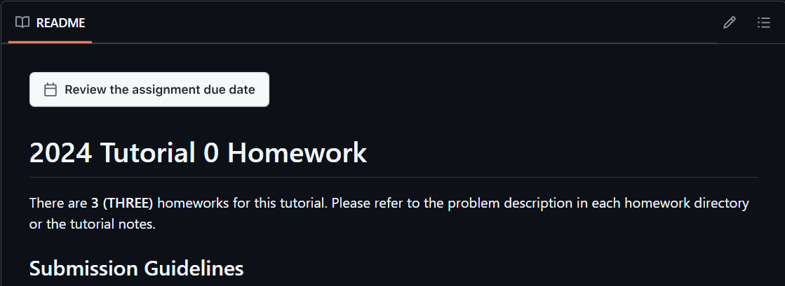

# Tutorial 0: Basic C (Self-Learned)

> Tutorial 0 (Programmers count from 0)

### Tutorial 0

- Content: Basics of C
- Time: Before the first tutorial of your session
- Venue: Virtual
- Classworks: None (However, try the self-tests out)
- Homeworks: 3 Programming Assignments
- Homework Deadline: 27 Sep 2024 (Fri) 18:00

But we highly recommend you to finish the homework before your Tutorial 1

### Tutorial 0 Targets

* Understand basic C syntax and do simple control flows
* Knows how to run your C program
* Introduce you to programming concepts if you are not familiar yet

## Tutorial 0 Links

Not too Important:

* [01) Intro](01-intro.md)

Your first C program 

* [02) Where to run your C code](02-where-to-write-code.md)
* [03) Hello World](03-hello-world.md)

Basic Concepts of Programming

> Concepts that are less important but are still worth a quick read before moving on to the next part are marked with `*`

We will actually rediscuss these in your first tutorial, but please learn about them early, especially if this is the first time for you to write program.

* [04) Variables and Input-Output](04-variable-io.md) 
  * [Variables and Data Types](04-variable-io.md#variables-and-data-types)
  * [Input/Output: `printf` and `scanf`](04-variable-io.md#input-output-printf-and-scanf)
  * [Self-Tests](04-variable-io.md#self-test)

* [05) Operators](05-operators.md)
  * [Arithmetic Operators](05-operators.md#arithmetic-operators)
  * [Compound Assignment Operators](05-operators.md#compound-assignment-operators)
  * [Relational Operators](05-operators.md#relational-operators)
  * [Logical Operators](05-operators.md#logical-operators)
  * [Self-Tests](05-operators.md#self-test) (Intentionally before Increments and Decrements)
  * [Increments and Decrements*](05-operators.md#increments-and-decrements)

* [06) Rules and Extra Features*](06-rules-and-extra-features.md) 
  * Rules on variable naming, booleans, standard integers, casting, and `const` keyword

* [07) Control Flow](07-control-flow.md)
  * [`if - else if - else`](07-control-flow.md#if-else-if-and-else-statements)
  * [`switch`](07-control-flow.md#switch-statements)
  * [`while`](07-control-flow.md#while-loop)
  * [`do while`](07-control-flow.md#do-while-loop)
  * [`for`](07-control-flow.md#for-loop)
  * [`break` and `continue`](07-control-flow.md#break-and-continue)
  * [Self Test](07-control-flow.md#self-test) (Intentionally before Scope)
  * [Scope*](07-control-flow.md#scopes)

To further support your self-learning process, we provided some self-tests at the end of each materials to check your understanding.

## Some Notes for C Programming

> Note: To paste inputs/commands into the terminal, you can type Ctrl + V

> Note: If you copy an input into a terminal, Programiz may sometimes re-output your input, this is normal. 

> Note: If your code runs indefinitely and does not stop, you can stop it by typing Ctrl + C

## Homeworks

Please submit these homeworks before 27 Sep 2024 (Fri) 18:00

* [01) Swap Variables](homeworks/hw01-swap-variable.md)
* [02) Introduce Yourself](homeworks/hw02-introduce-yourself.md)
* [03) Print Shapes](homeworks/hw03-print-shapes.md)

Submission Method: `Github Classroom`

Please first accept the assignment on Github Classroom: [https://classroom.github.com/a/KiL_n4Dy](https://classroom.github.com/a/KiL_n4Dy) and the click the link to your working repository. Details of the submission will later be given there (note that the picture below is just for your reference, it is not your workspace link and the due date is wrong).

You can see the submission guidelines on the README shown below the file list.

 

[To Tutorial 1 Page](../tutorial-1-c-and-cubeide-setup/README.md)
