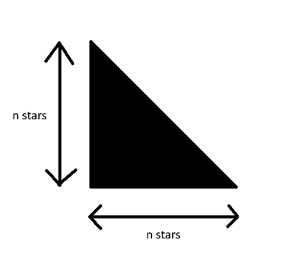
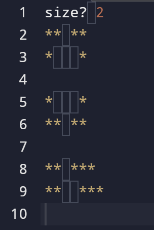

[Back to Main](../README.md)

# Print Shapes

> Pixel art

<details>

<summary>Authors</summary>

Dicaprio Cheung (dhcheungaa@connect.ust.hk)

</details>

It is recommended to understand everything before `Control Flow` before attempting this homework

## Level 1 : Warm Up

In this assignment, we would like to draw some shapes with the character "*"

First, we will ask the user to tell us the size of the shape with the prompt `"size? "`
Then, the program should draw the shape given in the image:



#### Example
```
size? 3
*
**
***
```

```
size? 5
*
**
***
****
*****
```

## Level 2 : Actual Homework

Totally same with Level 1 but draw a much bigger shape (only draw the red part)


#### Example



You can assume the size is an integer > 1

## How to Run Your Code

To run the code, you need to make sure that you are first in the right folder/directory in your terminal (the text area under your code):
Currently, in the example, the user is in the directory `/workspaces/codespaces-blank` you need to get to `/workspaces/codespaces-blank/<homework-repository-name>/hw3` to run your `main.c` code, do this by writing the command `cd <homework-repository-name>/hw3` (cd: change directory) and press enter.

(Note: if you want to go up a folder you can use `cd ..`)


Note that you need to do this everytime you open the Github Codespace.

Once you are in the direcctory, run the following command in the terminal:
```
gcc -o homework.exe main.c && ./homework.exe
```
(Note: for a C code to run, we need to make it an executable file, then run it)


## Submission

Modify `main.c` in the `hw3` folder containing your *level 2* code for your homework. We will not grade your level 1 code. Refer to the [Main README.md](../README.md) for details.

