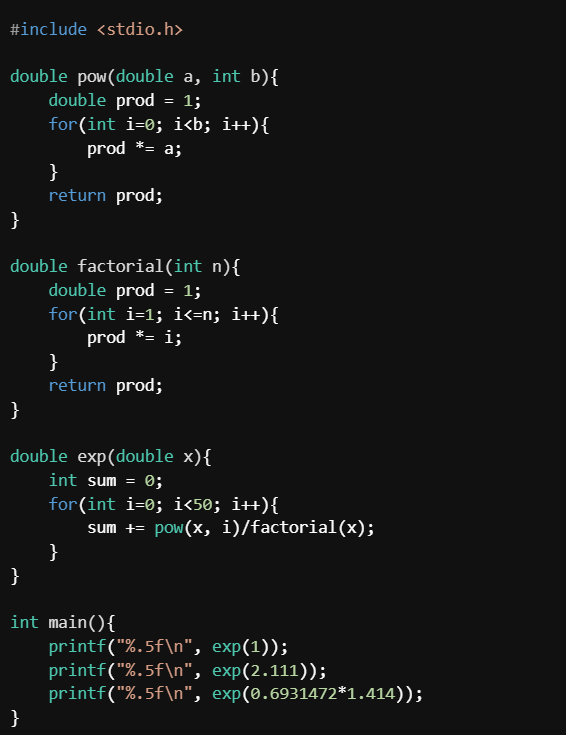

[Back to Main](README.md) | [Previous Page](08-array-string.md)

# Functions

> Wrap a block of code with a name so we don't need to write the same thing many times

> There are some topics that are less important, they will be marked with `*` in the title. But we may need a slight understanding of it for the next parts.

Consider the following situation: you would like to work on a system for the movement of a robot, the code to make it move might look something like (This is not an actual working code, you don't need to understand it, just know that it is quite long):

```c
if(motor1_done_init()){
    motor1_init();
}
int motor1_target_speed = 500; //can be changed according to the situation
const int err_to_current  = 25;
int err = motor1_get_speed() - motor1_target_speed;
if(err < 0){
    motor1_set_anticlockwise();
    err = -err;
}else{
    motor1_set_clockwise();
}
printf("[Debugger] Motor 1 current speed: %d", motor1_get_speed());
motor1_set_current(err * err_to_current);
```

But then this is only for one motor, in a program in which you need to control more than one motors then it may look like:

```c
#include "robot_utility.h"

int main(){

    /* Imagine a line follower car robot, you have two motors on the left (1 and 3), and two motors on the right (2 and 4) */

    /* When the sensor detects a black line, we will let the wheels on the left to move forward, while those on the right will move backward */

    while(1){
        
        if(IR_sensor_black()){
            //turn right

            if(motor1_done_init()){
                motor1_init();
            }
            int motor1_target_speed = 500; //move forward
            const int err_to_current  = 25;
            int err = motor1_get_speed() - motor1_target_speed;
            if(err < 0){
                motor1_set_anticlockwise();
                err = -err;
            }else{
                motor1_set_clockwise();
            }
            printf("[Debugger] Motor 1 current speed: %d", motor1_get_speed());
            motor1_set_current(err * err_to_current);

            if(motor3_done_init()){
                motor3_init();
            }
            int motor1_target_speed = 500; //move forward
            const int err_to_current  = 25;
            int err = motor3_get_speed() - motor3_target_speed;
            if(err < 0){
                motor3_set_anticlockwise();
                err = -err;
            }else{
                motor3_set_clockwise();
            }
            
            printf("[Debugger] Motor 1 current speed: %d", motor2_get_speed());
            motor2_set_current(err * err_to_current);

            if(motor2_done_init()){
                motor2_init();
            }
            int motor2_target_speed = -500; //move backward
            const int err_to_current  = 25;
            int err = motor2_get_speed() - motor2_target_speed;
            if(err < 0){
                motor2_set_anticlockwise();
                err = -err;
            }else{
                motor1_set_clockwise();
            }
            printf("[Debugger] Motor 2 current speed: %d", motor2_get_speed());
            motor2_set_current(err * err_to_current);

/* The rest are not shown to not make this page too long and boring to read */

```

The code above is repetitive and quite bug prone due to changes that you need to do manually (the writer forgets to change `motor1_clockwise()` to `motor2_clockwise()` in the last part, the debugger printf for motor 3 is not right, etc.).

Could it be better if somehow we can do the following: we give a name to the code block, maybe something like `motor_move` and we can also tell it the ID of the motor and the speed? The code will look cleaner:

```c
#include "robot_utility.h"

int main(){
    if(IR_sensor_black()){
        motor_move(1, 500); motor_move(3, 500);
        motor_move(2, -500); motor_move(4, -500);
    }else{
        motor_move(2, 500); motor_move(4, 500);
        motor_move(1, -500); motor_move(3, -500);
    }
}
```

This is the idea of function, a way to "name" a code block to be reused.

We actually have used some functions before: `printf()` and `scanf()`. Functions provide **abstraction**, i.e. providing a simpler interface to hide complex implementations.

## Function Definition and Call

You may not realize, but we have actually define a function before. `main()` is a function and the codes we written inside of it (body of the function) is the code that we have "named" as `main`

The more general syntax for a function definition is the following:

```
<return_type> <function_name> (<parameter_list>) {
    <function_body>
}
```

`function_name` is what you want to name your code block, and `function_body` is what you want to store.

We will explain the other two soon.

In the case of `int main()`:
```c
int main(){
    //your code
    return 0;
}
```
You should be able to see the pattern

### `return`

Function can also be thought as a mathematical function, e.g. $f(x), \sin(x), \max(x, y), $ etc.

You can *pass* some `parameters` to it, and you can get a value out of it, for example $\sin(\frac\pi2) = 1, \max(17, 42) = 42$ the *evaluated value* is called the `returned value`.

In the case of programming, you can think of the process of running a function as such:

* Pass the function some `parameter`
* The function will run the code you have "named" as the function name
* Returns a return value

```c
int max(int x, int y){ //pass arguments

    int result = x //run the code
    if(y > x){
        result = y; 
    }

    return result; //return the evaluated result (return value)
}
```
You can also have more than one keyword `return`, however, once you call `return`, you will break out of the function (recall what will happen if you call `break` in a loop).

```c
int max(int x, int y){
    if(y > x){
        return y;
    }
    return x;
}
```

`parameter_list` is the list of paramaters you want to pass to the function.

The value you want to write after the keyword `return` must be of type `return_value`.

To actually use a function, you need to call it, the syntax is as follow:

```
<function_name>(<actual_values_as_the_parameter>)
```

This is how it will look like in a code:
```c
#include <stdio.h>

int max(int x, int y){
    if(y > x){
        return y;
    }
    return x;
}

int main(){
    int value = max(17,42); //here, we call the function max with the paramters 17 and 42
    printf("%d", value); 
}
```

The return value will be placed at the location of `max(17, 42)`:
```c
int value = 42;
```

Note that you can also pass variables as parameters
```c
int a = 3; 
max(a, 1); //returns 3
```

Consider another example of function:
```c
#include <stdio.h>

int power(int x, int y){
    int prod = 1;
    for(int i=0; i<y; i++){
        prod *= x;
    }
    return prod;
}

int main(){
    printf("3^4 is %d", power(3,4)); //think about what is happening here
}
```

### `void`: the absence of things to return
In some cases, however, you may want to just run a the code within the function but not return any value. You may do so by making the `return_type` a `void`

```c
void just_run_the_code_inside(){
    for(int i=0; i<100; i++){
        int x = 1;
        for(int j=2; j*j<i; j++){
            if(i%j==0){
                x = 0; break;
            }
        }
        if(x){
            printf("%d\n", i);
        }
    }

    return; //you can add a return keyword to break out of the function, but you are not allowed to add anything after it, this return is optional
}
```

Note that, in this case you must define a function at a location before it is called (i.e. you cannot define a function under `int main()` the compiler will not know the function name yet)

If you would like to use `struct`s as the parameter, it is completely fine to do so.

## Optional Exercise

> We covered the materials needed for your **Optional Exercise 3**! You can access it [here](classwork/classwork-3-area-of-circle.md) (used to be a classwork).Feel free to give it a try to check your understanding.

## Pass an Array to a Function
If you would like to pass an array to a function, you can write it as the following:
```
<function_name>(<array_data_type> <array_name>[<size1>][<size2>][...])
```
However, you usually will also need to pass the size of the array to the function.

For example:
```c
#include <stdio.h>

double compute_mean(int data[], int size){ //remember that the first [] can have nothing inside
    double sum = 0;
    for(int i=0; i<size; i++){
        sum += data[i];
    }
    return sum/size;
}

int main(){
    int homework_grade[] = {77, 87, 89, 75, 78, 91, 92, 98, 0, 0};
    printf("%.3f", compute_mean(homework_grade, 10)); //prints 68.700
}
```

Please also note that if you access any member of the array and modify it, you will modify the content permanently. However in the case of functions, it is not, this is because functions will make a local variable for the parameters that are separate instances of the variable.

```c
#include <stdio.h>

void square_array(int data[], int size){
    for(int i=0; i<size; i++){
        data[i] = data[i]*data[i];
    }
}

void print_array(int data[], int size){
    printf("[ ");
    for(int i=0; i<size; i++){
        printf("%d ", data[i]);
    }
    printf("]\n");
}

void square(int a){
    //when you pass a value, say 9, the function will declare a local variable int a = 9; it is a separate instance from the variable you pass. The local variable will be destroyed once the program exits the function
    a = a*a;
    printf("%d ", a); //here it prints 81
}

int main(){
    int A[] = {1,2,3,4,5,6,7,8};
    print_array(A, 8); //prints [ 1 2 3 4 5 6 7 8 ]
    square_array(A, 8);
    print_array(A, 8); //prints [ 1 4 9 16 25 36 49 64 ]

    //c.f.
    int x=9; printf("%d ", x); square(x); printf("%d\n", x); 
    //prints 9 81 9
}
```

However, you cannot return an array from a function (unless you would like to deal with pointers)

## How to Modify Non-Array Variables in Functions

In this case, we need to use pointers...

> If you are currently studying COMP2011, you might learn about references soon. The problem is that reference is not a feature in C and we only have pointers...

In simple words, you can add a star (`*`) in front of the parameter list and pass it with a `&` to make it work. We will discuss it in detail in the advanced reading.

```c
#include <stdio.h>
void swap_not_working(int a, int b){
    int tmp = a;
    a = b;
    b = tmp;
}

void swap(int *a, int *b){ //put star in front of the variable name
    int tmp = *a;
    *a = *b;
    *b = tmp;
}

void square(int *a){
    *a = (*a) * (*a);
}

int main(){
    int x = 1; int y = 2;

    //the following three lines will succesfully swap the valules
    int tmp = x;
    x = y;
    y = tmp;

    printf("%d %d\n", x, y); //prints 2 1

    //this will not work
    swap_not_working(x, y);
    printf("%d %d\n", x, y); //prints 2 1

    //but this will work
    swap(&x, &y);
    printf("%d %d\n", x, y); //prints 1 2

    int z = 9;
    square(&z);
    printf("%d", z); //prints 81, now this will work too
}
```

The short explanation for why this works is that instead of making a new variable, we give the compiler the address of the variable by adding the `&`. The function will manipulate everything directly there using the `*` operator.

## Function Declaration*
Now what if we want to provide the definition of the function later on (e.g. after the `int main())

This might seem trivial but this is quite important to understand before you learn about multi file programming.

You can first declare a function, then define it later. You can declare a function by writing (please mind that there is a semicolon):

```
<return_type> <function_name>(<paramater_list>);
```

For example:
```c
#include <stdio.h>

int power(int, int); //you can remove the parameter variable name in the declaration

int main(){
    printf("%d", power(3, 4)); //compiler can know what it returns and what you need to pass to it, this will work fine and prints 81
}

int power(int a, int b){ //define the body later
    int prod = 1;
    for(int i=0; i<b; i++){
        prod *= a;
    }
    return prod;
}
```

Another example to consider:
```c
#include <stdio.h>

_Bool odd(int x);
_Bool even(int x);

//odd depends on even, even depends on odd:

_Bool odd(int x){
    if(x==0) return 0; //0 is not odd
    return even(x-1);
}

_Bool even(int x){
    if(x==0) return 1; //0 is even
    return odd(x-1);
}

int main(){
    printf("Is odd? %s\nIs even? %s", odd(7)?"true":"false", even(7)?"true":"false");
}
```


## Self tests 

Q1. Calculate $e^x$ in C

Earlier, we implemented the function for computing a number to the power of another, i.e. $\textsf{power}(a,b) = a^b$. However our method only works for integer $b$. We cannot really compute $2^{1.414}$ this way.

Let's generalize this with some calculus knowledge. It is possible to compute $e^{x}$ by an infinte sum.

$$e^x = \lim_{N \to \infty} \sum_{i=0}^N \frac{x^i}{i!}=1+x+\frac{x^2}{2!}+\frac{x^3}{3!}+...=\sum_{i=0}^N \frac{x^i}{i!}=1+x+\frac{x^2}{2}+\frac{x^3}{6}+...$$

Note that $n!$ is the factorial, the product of the numbers in range $[1,n]$. For example $6! = 6 \cdot 5 \cdot 4 \cdot 3 \cdot 2 \cdot 1 =720$

Note that we can use $a^b = e^{(b\ln(a))}$.

Assume that we only consider the first $50$ term, i.e. $N=50$. Implement a code to show:

$e = 2.7182...$

$e^{2.111}= 8.2564...$

$2^{1.414} = 2.6647...$ given that $\ln(2) = 0.6931472$

To make things easier for you, try to implement $\textsf{pow}(a,b)$ to power `double` to `int` and $\textsf{factorial}(n)$ to compute $n!$ (please return a `double` for more precision) first.

<details>
One of such possible answer is the following (note that the solution prints the number in 5 decimal places, just check the first 4)



<summary>Ans</summary>
</details>


[Continue to The Next Page](10-struct.md)
