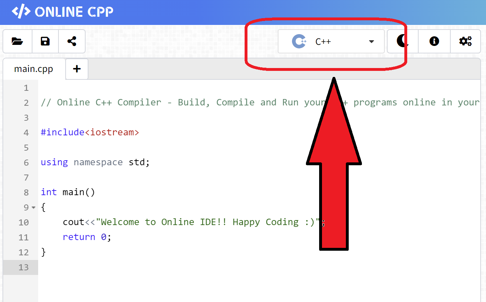
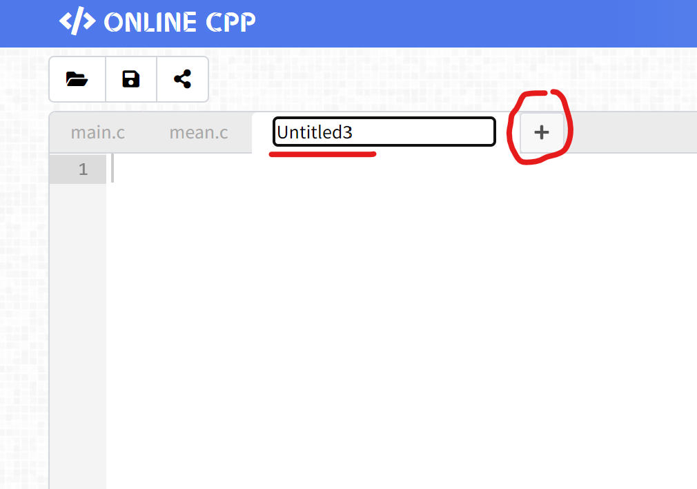

[Back to Main](../../README.md)

# Classwork 5 : Mean Median Min Max

> What do mathematicians sleep on? Matrices!!

<details>

<summary>Authors</summary>

Dicaprio Cheung (dhcheungaa@connect.ust.hk)

</details>

## Problem

Use the given skeleton code to write a program to find the mean, median, min, and max of a set of numbers.

The skeleton code is separated into multiple files:
- `main.c` the main part of the code which handles the input of the set of numbers
- `mean.c` the file that calculates the mean of the set of numbers 
- `median.c` the file that calculates the median of the set of numbers 
- `min_max.c` the file that calculates the min and max of the set of numbers 
- `mean.h` the header file of `mean.c`
- `median.h` the header file of `median.c`
- `min_max.h` the header file of `min_max.c`

The mean is the average value of a set of numbers.

e.g. Mean of {1, 2, 3, 3, 1, 2} = (1 + 2 + 3 + 3 + 1 + 2) / 6 = 2

The median is the number that is ranked in the middle after the array is sorted. Please refer to the following explanation for implementing sort algorithm https://www.geeksforgeeks.org/bubble-sort-algorithm/ 

e.g. median of {1, 1, 1, 1, 1, 4, 9} is 1

For arrays of even length, the median is the average of the two elements in the middle. e.g. median of {1, 1, 2, 3, 6, 7} = (2 + 3) / 2 = 2.5

The min is the smallest number in the set

The max is the biggest number in the set

#### Assumption

- There will be at most 300 numbers in the set.
- The input numbers are inside `float` range and valid data will only be **non-negative numbers**.

#### Example

The execution of the program should look like this:

```
Enter a number to append to the number set. Enter "-1" to stop appending.
>1
>2
>4
>9
>0
>2
>-1
Mean=3.000000
Median=2.000000
Min=0.000000
Max=9.000000
```

## How to compile and run the code

### Online Cpp

[**Online Cpp**(https://online-cpp.com)](https://online-cpp.com) is a good online compiler for multi-file programming if you haven't install any compilers on your computer and you don't want to login your github account.

***First, remember to switch to C instead of C++***



Second, you can create new `.c` `.h` files by clicking the `+` button and rename the new files



Thirdly, copy our given code from the `skeleton code` folder into online-cpp and start writing your code.

Finally, press `Run` to run your code

### Github Codespace

To compile your program that has multiple `.c` files, you need to type `gcc` command.

You can revise `gcc` command from our notes [11-multi-file-programming Separate Compilation](../../11-multi-file-programming.md#separate-compilation)

or you can copy the `gcc` commands below and run it directly

<details>

<summary>gcc commands answer</summary>

```
gcc -c main.c mean.c median.c min_max.c
gcc main.o mean.o median.o min_max.o
.\a.exe
```

</details>
