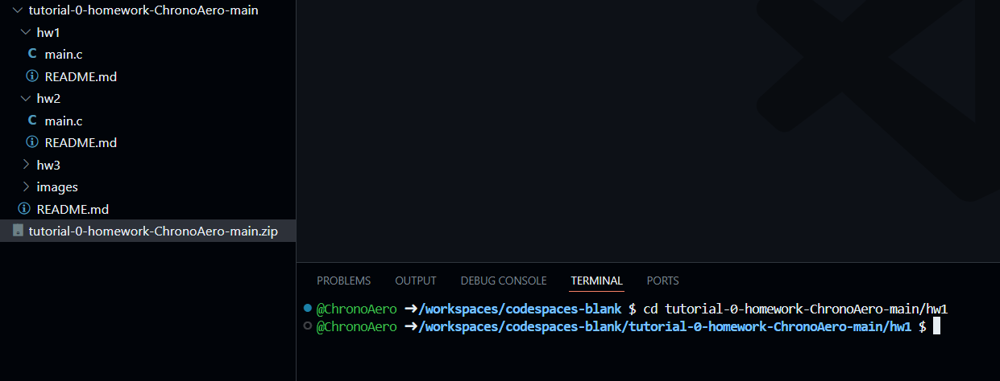

[Back to Main](../../README.md)

# Task 1: Number system convertor

> `0xdeadbeef` = `3735928559` 

<details>

<summary>Authors</summary>

Li Chi Kin (ckliam@connect.ust.hk)

</details>

## Problem

This task is designed for fun :) &#x20;

There are so many number systems. We encounter some unusual number systems in our daily lives, namely, decimal (base 10), duodecimal (base 12), and trinary (base 3).&#x20;

Write a Number System Converter that converts a number from one system to another. You have to handle 3 systems: decimal, duodecimal, and trinary. The converter should be able to convert from/to any of the three systems.

## Assumption

1. There are no spaces between the digits of the input string.
2. The input string is a non-negative integer. Or else it throws an error message.
3. The input and output values are in range:   $$0\leq n\leq 2^{64}-1$$
4. The inputted number system must be an integer.

## Example

(Do not add an extra newline for the case of succesful conversion)


This is an example that converts 123123123 from decimal to trinary:

```
Please enter a set of number:
123123123
Please enter the current number system:
10
Please enter the number system you want the set of number be converted to:
3
Output=22120200022011200
```

This is an example that converts 5201314 from decimal to duodecimal (base 12)

```
Please enter a set of number:
5201314
Please enter the current number system:
10
Please enter the number system you want the set of number be converted to:
12
Output=18AA02A
```

You can verify the answer as below:

(A = 10, B = 11)

$$5201314 = 1\times12^{6}+8\times12^{5}+10\times12^4+10\times12^3+0\times12^2+2\times12+10$$


## Example - Error

However, if the user entered a wrong number system, an error message should be printed:

Please enter a set of number:

(Error messages has newlines at the end)

```
Please enter a set of number:
9999 
Please enter the current number system:
3
Error! That set of number is not a trinary number.

```

```
Please enter a set of number:
ABCDEF 
Please enter the current number system:
12 
Error! That set of number is not a duodecimal number.

```

```
Please enter a set of number:
987456321
Please enter the current number system:
27
Error! The number system is not supported.

```

## How to Run Your Code

To run the code, you need to make sure that you are first in the right folder/directory in your terminal (the text area under your code):
Currently, in the example, the user is in the directory `/workspaces/codespaces-blank` you need to get to `/workspaces/codespaces-blank/<homework-repository-name>/hw1` to run your `main.c` code, do this by writing the command `cd <homework-repository-name>/hw1` (cd: change directory) and press enter.

(Note: if you want to go up a folder you can use `cd ..`)


Note that you need to do this everytime you open the Github Codespace.

Once you are in the direcctory, run the following command in the terminal:
```
gcc -o homework.exe main.c && ./homework.exe 
``` 



To give input, you can write in the terminal directly and press enter when you are finished.

(Note: for a C code to run, we need to make it an executable file, then run it)


## Submission
Modify your `main.c` file. We still use Github Classroom to grade your submissions, the instruction is still similar to the one in Tutorial 0 README.md.
