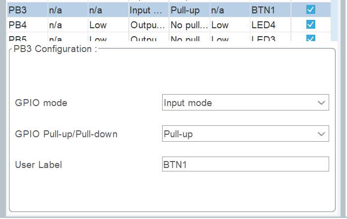
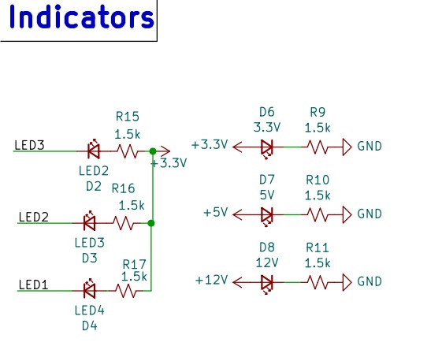
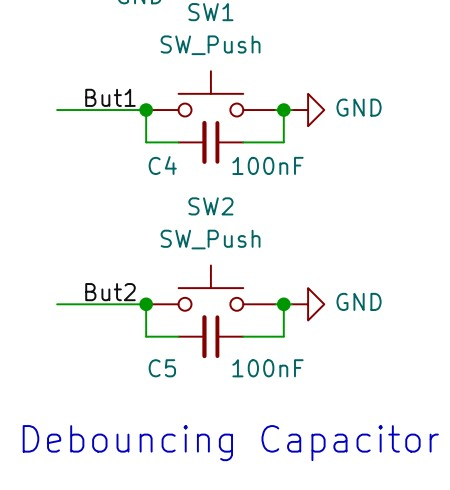
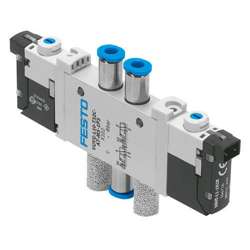
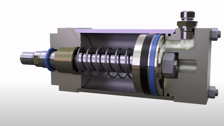

[Back to Main](README.md) | [Previous Page](01-Basic-structure.md)

# GPIO

> What is a pin?:\
> Take a look to the PCB, you can see a lot of tin line that aligned with the mcu, those are what we can pins, which is the only channel how the MCU connect with all the peripherals and make interaction with any things.
> 

## Introduction to GPIOs

General-Purpose Input/Output (GPIO) pins are essential components in embedded systems, allowing for interaction with the external environment. These digital signal pins can be configured as inputs or outputs, enabling the microcontroller to read or send discrete signals, typically represented as `HIGH (1)` or `LOW (0)`.(Sometimes we will use GPIO for analogue values but don't worry about that for now)

### Pin Naming

- Each microcontroller unit (MCU) pin can function as a GPIO .
  - These pins are organized into blocks of 16, named by letters: `GPIOA`, `GPIOB`, `GPIOC`...
    - Within each block, pins are numbered from 0 onwards, e.g., `GPIO_PIN_0`, `GPIO_PIN_1`, `GPIO_PIN_2`...
- Thus, a pin is identified by its port and number, like `GPIOE`, `GPIO_PIN_3`, often referred to as `PE3`.

To simplify code readability and maintenance, meaningful names can be assigned to pins using macros in the `main.h` file or directly within the CubeMX configuration.

1.  Configuring the Macros:

Inside `main.h` , you can find:

```c
/* Private defines -----------------------------------------------------------*/
#define BTN1_Pin GPIO_PIN_3
#define BTN1_GPIO_Port GPIOB
/* USER CODE BEGIN Private defines */
```

⚠️Noted that your change here will be covered when you regenerate code thru CubeMX

2.  Update the Pinout Name inside CubeMX

    <figure><figcaption></figcaption></figure>

    You can see that we name the PB3 as BTN1 inside the config, and the CubeMX will auto generate the Macros in the lefthand side

## GPIO Read and Write Function

### GPIO Input

With the correct configuration of GPIO, you would like to input and output. The library here we use is `HAL` Library

The `HAL_GPIO_ReadPin` function reads the GPIO input.

```c
/* stm32f4xx_hal_gpio.h */
GPIO_PinState HAL_GPIO_ReadPin(GPIO_TypeDef GPIOx, uint16_t GPIO_Pin);
// usage
uint8_t state = HAL_GPIO_ReadPin(BTN1_GPIO_Port, BTN1_Pin); // returns 0 or 1

//To Improve the Readability, recalling we have
    #define BTN1_Pin GPIO_PIN_3
    #define BTN1_GPIO_Port GPIOB
// Therefore you can:
#define gpio_read(gpio) HAL_GPIO_ReadPin(gpio##_GPIO_Port, gpio##_Pin)
// usage
uint8_t state = gpio_read(BTN1);
```

### GPIO Output

To reduce your workload, we have written the following output macros in your `main.h` and you can directly calling it.

- The `gpio_set(gpio)` macro sets the GPIO pin to be 1.
- The `gpio_reset(gpio)` macro resets the GPIO pin to 0.
- The `gpio_toggle(gpio)` macro toggles the GPIO pin. (i.e. changes the GPIO pin state to 1 if it was originally 0 and vice versa)

```c
/* main.h */
// Sets the GPIO pin to HIGH
#define gpio_set(gpio) HAL_GPIO_WritePin(gpio##_GPIO_Port, gpio##_Pin, GPIO_PIN_SET)
// Sets the GPIO pin to LOW
#define gpio_reset(gpio) HAL_GPIO_WritePin(gpio##_GPIO_Port, gpio##_Pin, GPIO_PIN_RESET)
#define gpio_toggle(gpio) HAL_GPIO_TogglePin(gpio##_GPIO_Port, gpio##_Pin)

// usage
// Turns off the LED
gpio_set(LED1);

// Turns on the LED
gpio_reset(LED1);

// Toggles the LED
gpio_toggle(LED1);
```

### Button and LED

While we have macros to directly read/write a pin, it does not guarantee what 0 and 1 actually do/mean. 0 and 1 are just two states the pin can be in. LEDs can be either on or off. However, there is no guarantee whether 0 means on or off. That is determined on the hardware level:

<figure><figcaption></figcaption></figure>

When you set the `LED1` Pin to 1, the LED will actually turn off, and turn on when set to 0.

<figure><figcaption></figcaption></figure>

Similarly, when you press the button, the `BUT1` will return 0 to you and when the button is released, `BUT1` will return 1.

To help reduce confusion and make your code more readable, we have provided the following:

```c
/* main.h */
#define led_on(led) gpio_reset(led) // set pin to 0 -> turn on LED
#define led_off(led) gpio_set(led)
#define led_toggle(led) gpio_toggle(led)

#define btn_read(btn) !gpio_read(btn)

/* main.c */
// NOTE: the following still works
// btn_read exists to help you but you can still use gpio_read
uint8_t btn1_state = !gpio_read(BTN1);
```

If one day your hardware groupmate accidentally swapped the wires of all LEDs, you can simply change the defines above. You don't need to read through your hundreds/thousands of lines of code and change every `gpio_set()` `gpio_reset()` and `gpio_read()` you wrote.

### Further Application: Pneumatic Valve

Another application you more likely to use for GPIO is pneumatic valves.

A pneumatic valve is a device that controls the flow of compressed air in a pneumatic system. By providing a signal, you can control the air flow passage between various components such as cylinders or actuators. Below is the picture of a pneumatic valve, and you can see two air input holes on top and one air output on the buttom:



Usually, we will connect the output of the valve to an air cylinder, which will expand when high pressure air flows in, and contract when the pressure is released. A clear gif is provided below for your understanding on how it works.



So with this this valve and air cylinder, you are able to make different mechanisms that only require simple movement.

<!--  -->

With the understanding on how this thing works, how you control it?
The control is really simple, the valve will be connected to one inpair source(High pressure) when you give a `3V3` signal, and connected to another one air source when you give a `GND` signal. At the same time, the LED on the valve should turn on when it receives a `3V3` signal.

[Continue to The Next Page](./03-HAL-Clock.md)
