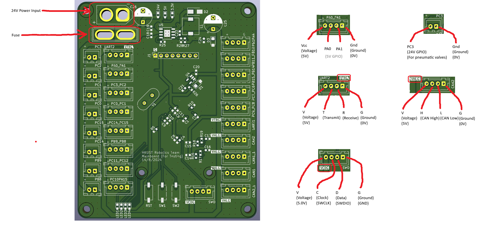
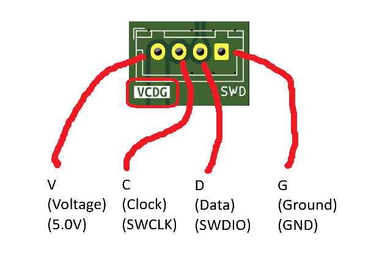
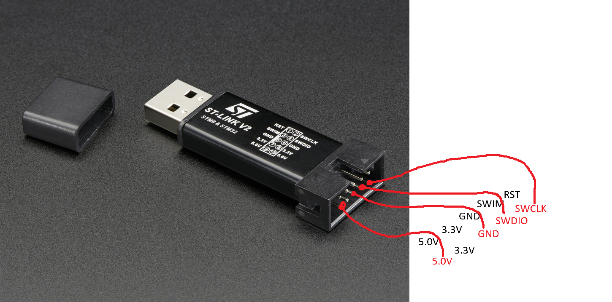
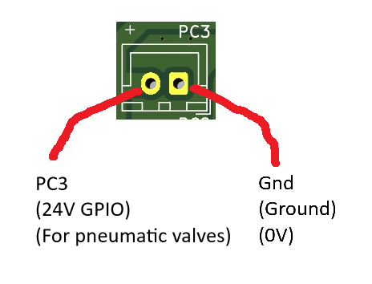
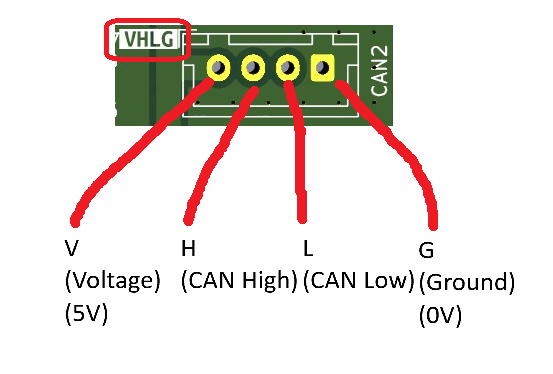
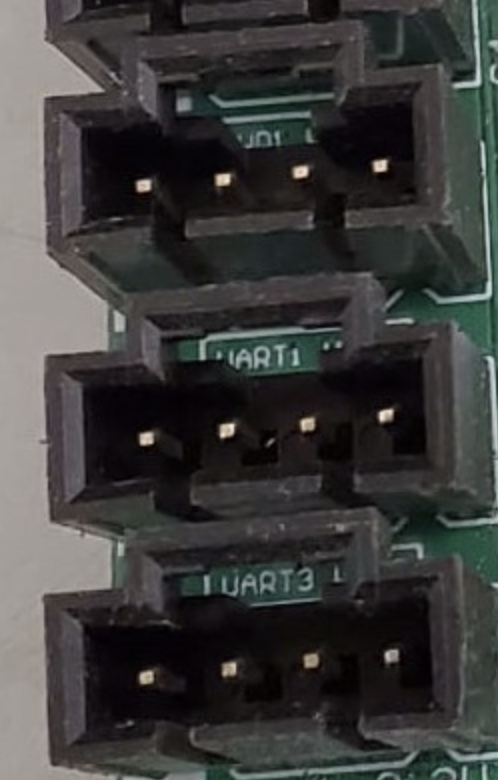
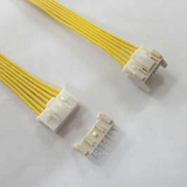
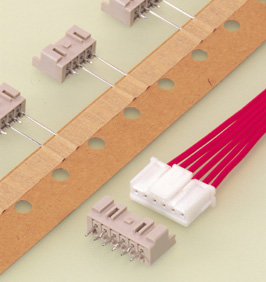
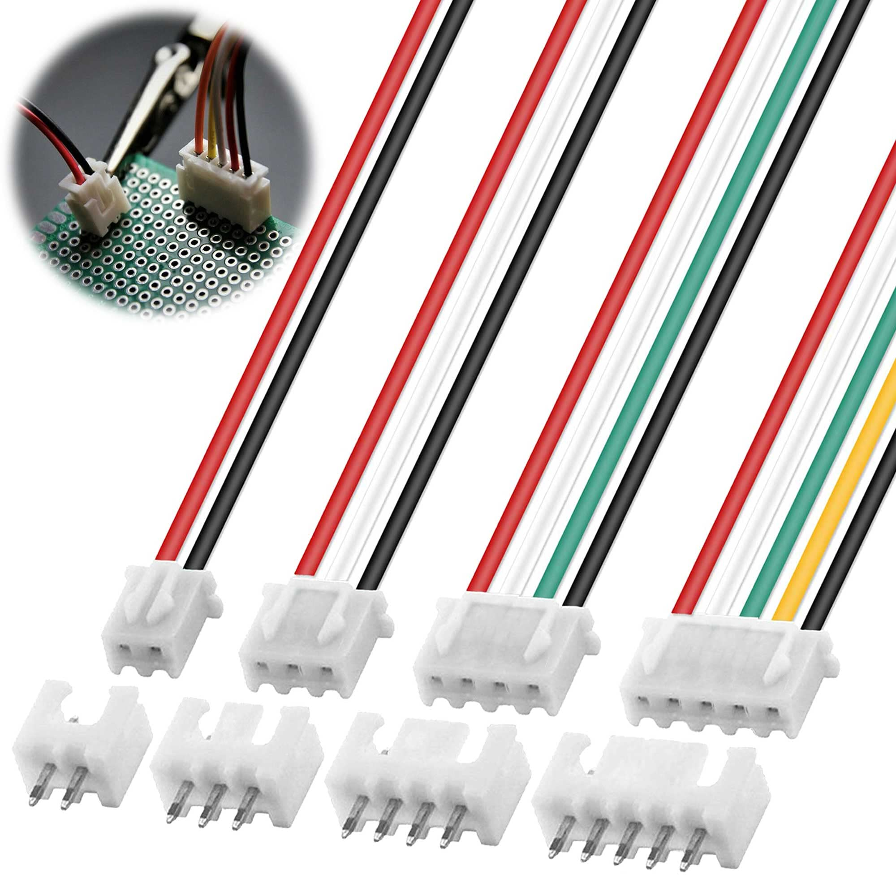
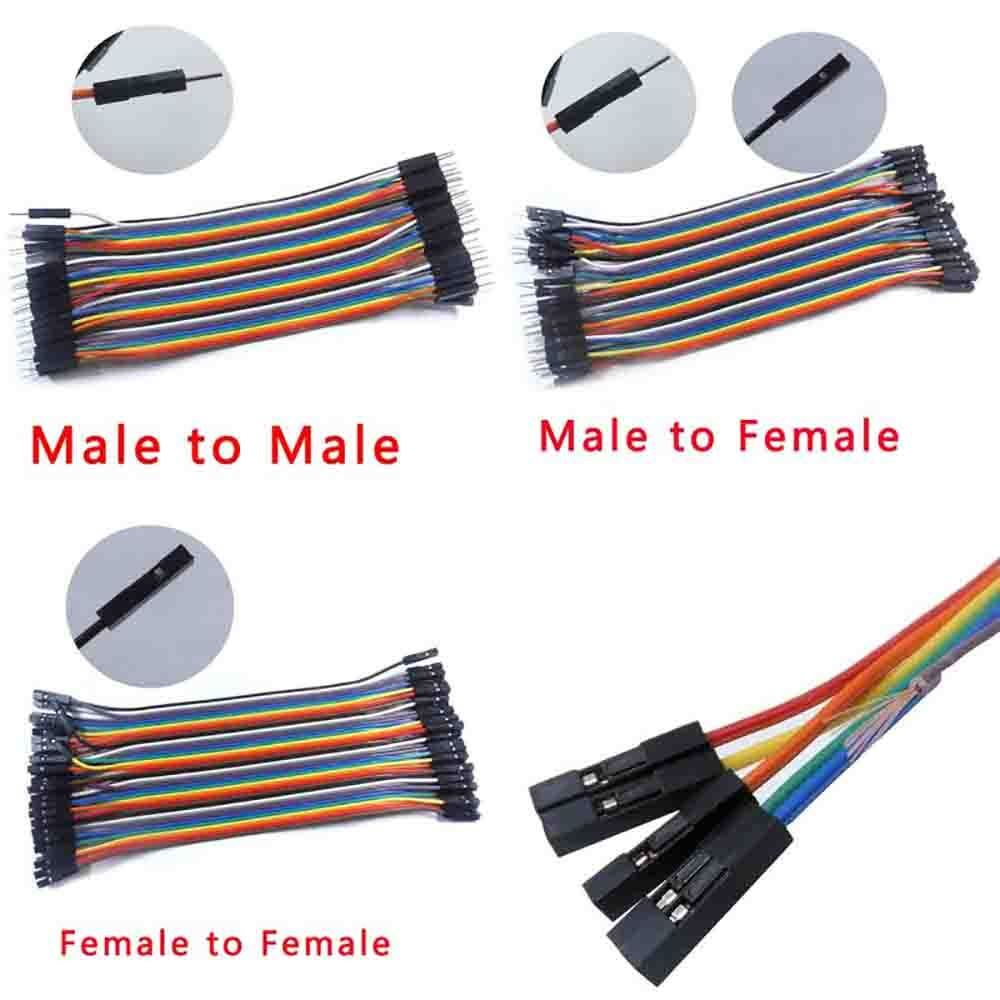

# Mainboard PINS
[Back to Main](README.md) | 

> Let's plug the wires ourselves

Authors

Dicaprio Cheung

# Mainboard pins

This is a summary of all different pins of our mainboard.

There is a 24V power input for us to connect to the battery. If your laptop is not strong enough to power the servo motor/other stuff, you need to connect to the battery.

There is also a fuse to prevent burning. (although i never see the fuse on the mainboard burn before... it is always the mainboard burn first...)

## SWD

This is the port where we used to flash code

You can connect the SWD to the corresponding pins of ST Link.

> keep in mind that there are 2 layers of pins in ST Link. Please plug in the correct layer

## 5V GPIO pins

This is a normal 5V GPIO pin. 

We usually plug
- limit switches
- line following sensor
- small servo motor
- IR sensor
- Ultrasonic sensor
- etc.

in these ports

## 24V GPIO pins

This is a special GPIO pin that outputs 24V when connected to the 24 V battery

We usually plug 24V Pneumatic Solenoid Valve to it. (Then, the pneumatic valve connect to the pneumatic cylinder we demo-ed in Tutorial 2)

> There are some old mainboard (Green, Reset button NOT next to other buttons) that uses 12V battery instead. So, they can only connect 12V Pneumatic Solenoid Valve

## UART pins

> will be taught in Tutorial 4

This is a UART pin.

We usually plug
- Bluetooth
- TTL
- TOF sensor 
- etc.

in these ports

## CAN pins

> will be taught in Advanced Tutorial 2

This is a CAN port.

We usually plug
- ESC(Electronic Speed Controller) of Motors
- Other CAN ports of other boards
- etc.

in these ports

# Different connector heads of ports

Since Hardware department is experimenting with new connectors of the ports, there are many different connector heads

## Molex Connector

Molex Connector is the traditional one that we used in the previous years. It is black in color and we solder it on all SWD ports.

The most common one is the 4 pin one but there are 2, 3, 5, 6 pin versions of them.

## XA Connector

XA Connector is the rarest one because it is only soldered on the boards made in Spring 2024. It is in brownish-white color or we call it rice color in chinese.

The most common one is the 4 pin one but there are 2, 3, 5, 6 pin versions of them.

 

## XH Connector

XH Connector is the newest one and is soldered on most of the new mainboards you are using. It is white in color and is soldered on all ports except SWD.

The most common one is the 4 pin one but there are 2, 3, 5, 6 pin versions of them.

## Rainbow wires

When we are lazy, we will just use rainbow wires to connect things. You can tear a few wires out to use it when you need.

> DO NOT CONNECT VOLTAGE AND GROUND TOGETHER OR YOU WILL BURN YOUR BOARD!!!

[Continue to next page](./02-pwm-and-servo.md)