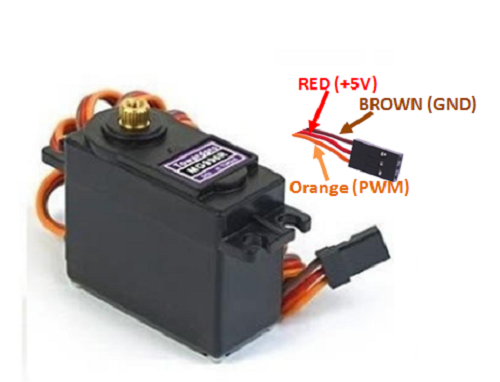
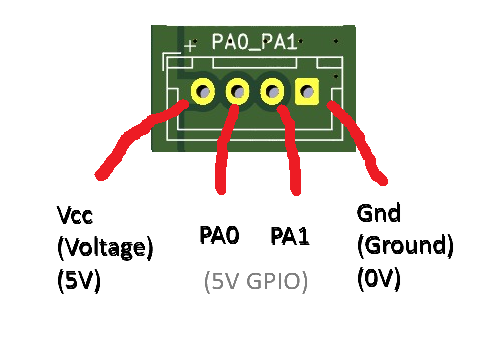

# PWM and Servo motor
[Back to Main](README.md) | [Previous Page](01-mainboard-pins.md)

> the tutorial with the most math

<details>

<summary>Authors</summary>

Dicaprio Cheung

</details>

# Servo Motor


### What is servo motor?

Servo motor is a special type of motor that can only rotate from -90 degree to 90 degree (or -135 to 135 degree for some other servos). It is DIFFERENT from the other motors you see before so you cannot make it spin like a wheel.

### How to control a servo motor?

To control a servo motor to move to a specific angle, we need to use send a PWM signal to the servo (and of course we also need to give it enough power to move).

# PWM

REF: ELEC1100 lecture 10 (2022, Deparment of Electronic and Computer Engineering, HKUST)  

### There are two main components of PWM generation:

1. The output frequency (1/T)
   * how fast it changes between HIGH and LOW
2. The on-time (The time of "HIGH voltage")
   * (_**Duty Cycle**_) which is **on-time** to **period** ratio
   * determines the percentage of time it outputs HIGH
   * in Second

#### How the two components controls the servo?

1. Different servos requires different output frequency. If the frequency is wrong, the servo cant understand the signal. Usually, our servos need 50 Hz.
2. On-time controls the angle of the servo.
   - From the datasheet above, (1000 ms = 1s)
     - When on-time = 1 ms, the servo points at -90 degree.
     - When on-time = 1.5 ms, the servo points at 0 degree(middle).
     - When on-time = 2 ms, the servo points at 90 degree.
   - Different model of servo might have slightly different on-time for different angles.
     - The one on your table might be 0.5 ms to 2.5 ms for -90 to 90 degree.

# Some PWM maths and basic knowledge

## MCU Clock

MCU\_Clock is the clock that determines the speed of the MCU(or CPU in layman's terms).

For the board you are using, the MCU_Clock runs at 84 MHz (or 84 000 000 Hz).

Inside the MCU, there are 8 Timers. TIM1 TIM2 TIM3 TIM4 TIM5 TIM6 TIM7 and TIM8, each timer can output a different frequency of PWM signal.

## Timer

For each timer, there is

```c
uint16_t PSC; // Prescaler Value
uint16_t ARR; // Auto Reload Register
```

The Prescalar Value and the Auto Reload Register is used to slow down the Timer frequency.

$$
Timer \space freqency = \frac{MCU\space Clock\space frequency}{(Prescaler\space Value+1) \cdot (Auto\space reloaded\space counter+1)}
$$

We will connect the timer to the servo motor. So, the Timer frequency = your desired PWM frequency = 50 Hz.

### Classwork 1

> [Classwork 1](03-classwork.md#classwork-1)


## Channel

For each Timer, there are 4 channels. TIM1_CH1, TIM1_CH2, TIM1_CH3, and TIM1_CH4.

Each Channel has its own Compare Register (CCRx).

```c
uint16_t CCR1; // Compare Register for CH1
uint16_t CCR2; // Compare Register for CH2
uint16_t CCR3; // Compare Register for CH3
uint16_t CCR4; // Compare Register for CH4
```

The Compare Register (CCRx) is used to control the On-time of that channel.

$$
Frequency = \frac{1}{Period}
$$

$$
Duty\space Cycle=\frac{CCR}{ARR + 1} = \frac{On-time}{Period}
$$

The ARR (auto reload register) from the previous paragraph is used as a downscaler of clock frequency. But in here, it acts as a denominator and `CCRx` acts as an numerator.

### Classwork 2

> [Classwork 2](03-classwork.md#classwork-2)

### Deep thinking: How to choose PSC and ARR?

Since ARR is the denominator for computing the On-time, we should choose a ARR that is largest possible such that we have more choices for CCR. So, our servo has more different positions to move to.

# How to write code for PWM

### Define the PWM features in the IDE

> There are many pins on the board. You need to find out which pin your TIMx_CHx is connected to.

There are 4 steps in setting up the PWM output channel and the pin to use.

1. In catergories, click **Timers** then choose the timer you want to use.

   Setup the **Mode** same as the figure shown. It's fine if you only get 1 channel.

   
2. Set the **Parameter Settings** same as the figure shown

> Supposedly, You don't have to change anything

&#x20;

3\. **IMPORTANT:** Enable the global interrupt of the timer.


4. Assign the GPIO pin to be the specific timer and channel. e.g Assign the PC7 pin to output the pwm signal of TIM3\_CH2.


5. Connect the servo motor to the correct pins of your mainboard

- Orange PWM wire of servo connect to the pin you chose (PC7(TIM3\_CH2) for the example above)
- Red 5V wire of servo connect to Vcc(Voltage) of GPIO port
- Brown GND wire of servo connect to GND(Ground) of GPIO port



### Start Coding!!!

There are 4 steps in coding:

1. Initialize the Timers for PWM

> This should be auto-generated in the beginning of `main.c`

```c
MX_TIM1_Init();
.
.
.
MX_TIM8_Init();
```

2. Set the Prescaler value, Auto Reload Register

```c
// in tutorial3_pwm.c in pwm_init()
TIM1->PSC = 1234;    // set the timer1 prescaler value
TIM1->ARR = 5678;    // set the timer1 auto reload register
```

> Note: `TIM1` stands for Timer 1. but we are using Timer 5 Channel 1 now!!!

> Hint: Use your Classwork 2 answers

3. Start the Timer (in `tutorial3_pwm.c` in `pwm_init()` )

```c
// in tutorial3_pwm.c in pwm_init()
HAL_TIM_PWM_Start(&htim1, TIM_CHANNEL_1); 
// HAL_TIM_PWM_Start(timer, channel);
// htim1 refers to timer 1
// We are using timer 5 channel 1!!!
```

> Hint:  `&htim1` means Timer 1, remember to change to Timer 5

4. Change the CCR as required for the classwork/homework

```c
TIM1->CCR1 = 321; //set the compare value of timer1 channel1
TIM1->CCR2 = 678; //set the compare value of timer1 channel2
```

> Hint: Use your Classwork 2 answers

#### Use the skeleton code `tutorial3_pwm.c` located in the`src` file!!

```c
// add the below in main.c
...
void SystemClock_Config(void);
/* USER CODE BEGIN PFP */

/* add the following 3 lines*/
void pwm_init(void); //add this line!
void pwm_classwork(void); //add this line!
void pwm_homework(void); //add this line!

/* USER CODE END PFP */
...
pwm_init(); //add this line!

while (1) {
    pwm_classwork(); //add this line!
}   
...
```

### Classwork 3

> [Classwork 3](03-classwork.md#classwork-3)
