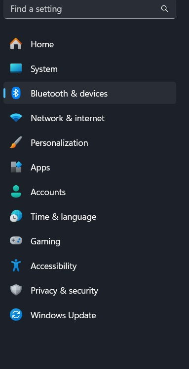
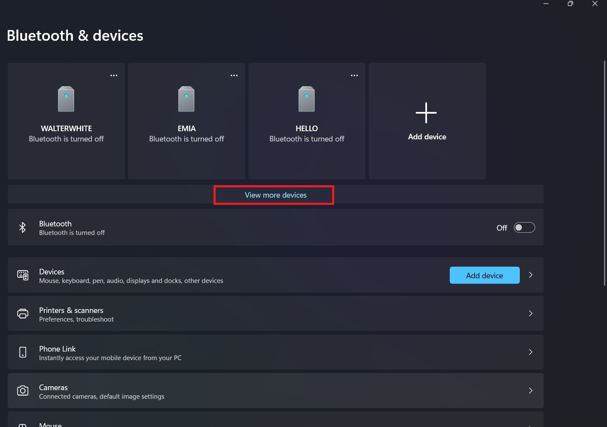
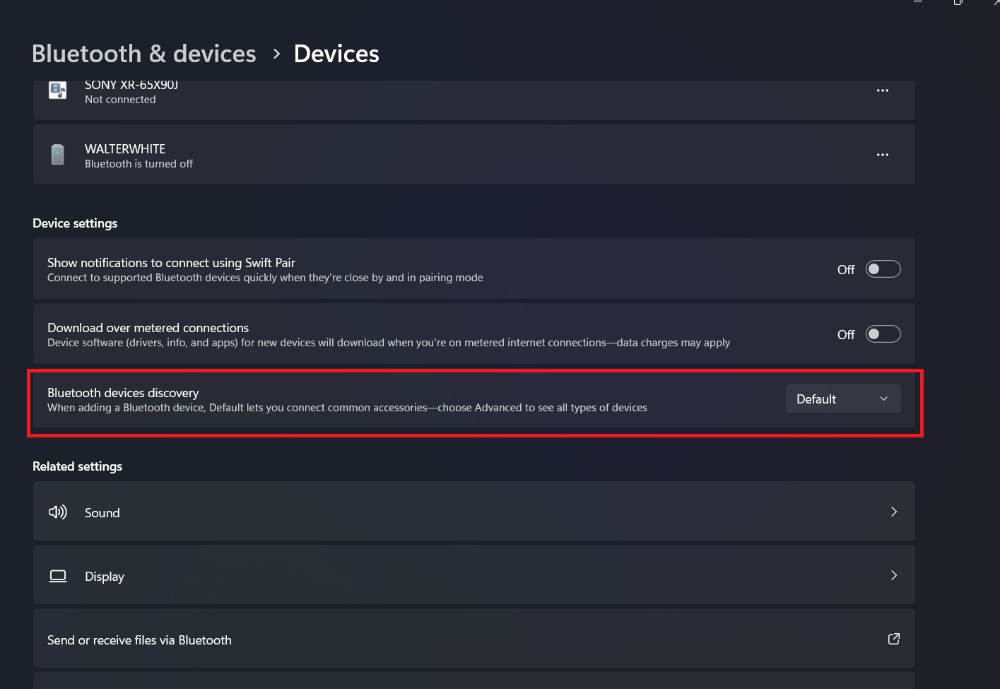
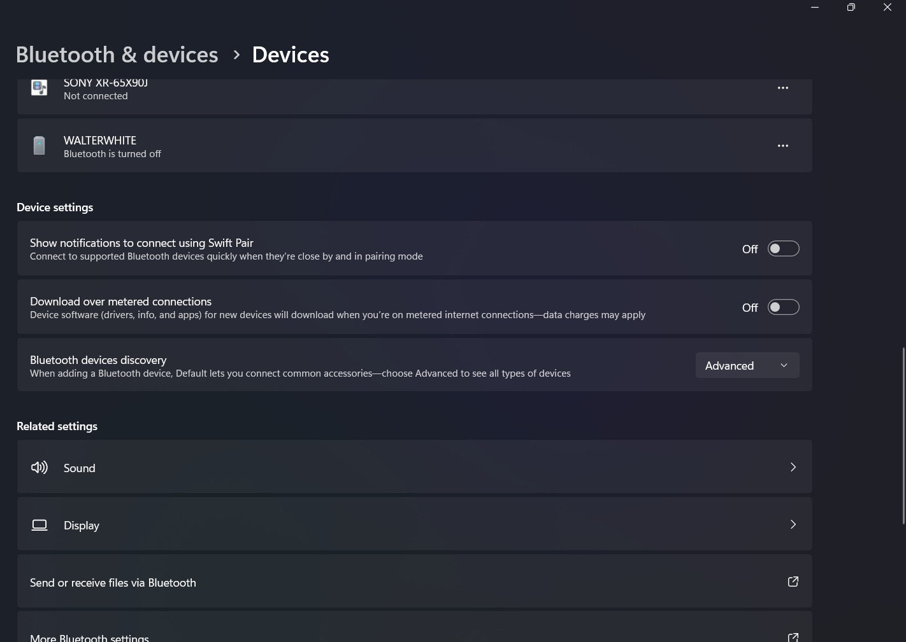

# Bluetooth problem solving (win11)
[Previous Page](02-bluetooth.md)

> Windows 11 has "updated" something about Bluetooth such that you can't find HC-05

## Steps

After configing HC-05, if you cannot find it from bluetooth connection, Please check for the below setup:

1. Open Settings, go to `Bluetooth & devices`

<figure><figcaption></figcaption></figure>

2. Go to `View more devices`

<figure><figcaption></figcaption></figure>

3. You can see a `Bluetooth devices discovery`, the default setting of this item is `Default`, which is limiting you to find HC-05. **Please change it to `Advanced`.**

<figure><figcaption></figcaption></figure>

## Final View:

<figure><figcaption></figcaption></figure>
